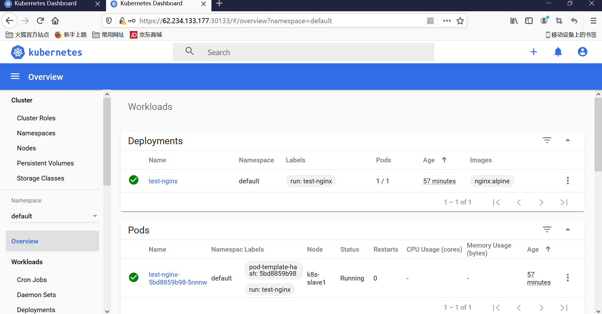

# Kubernetes 安装手册（非高可用版）


[TOC]

## 集群信息

### 1. 节点规划
部署k8s集群的节点按照用途可以划分为如下2类角色：

- **master**：集群的master节点，集群的初始化节点，基础配置不低于`2C4G`
- **slave**：集群的slave节点，可以多台，基础配置不低于`2C4G`

**本例为了演示slave节点的添加，会部署一台master+2台slave**，节点规划如下：

|主机名 |  节点ip  | 角色 | 部署组件  |
|:--: | :--:  | :--: | :--------: |
|k8s-master| 172.21.51.143 | master |  etcd, kube-apiserver, kube-controller-manager, kubectl, kubeadm, kubelet, kube-proxy, flannel|
|k8s-slave1 | 172.21.51.67 | slave |  kubectl, kubelet, kube-proxy, flannel  |
|k8s-slave2  | 172.21.51.68 |  slave  | kubectl, kubelet, kube-proxy, flannel |

### 2. 组件版本

| 组件      |    版本 | 说明  |
| :--: | :--:| :-- |
| CentOS  | 7.8.2003 |     |
| Kernel  | Linux 3.10.0-1127.10.1.el7.x86_64 |   |
| etcd    | 3.4.13-0 | 使用容器方式部署，默认数据挂载到本地路径 |
| coredns | 1.7.0 |  |
| kubeadm | v1.19.8 |  |
| kubectl | v1.19.8 |  |
| kubelet | v1.19.8 |  |
| kube-proxy | v1.19.8 |  |
| flannel | v0.11.0 |  |

## 安装前准备工作
### 1. 设置hosts解析
操作节点：所有节点（`k8s-master，k8s-slave`）均需执行

- **修改hostname**
hostname必须只能包含小写字母、数字、","、"-"，且开头结尾必须是小写字母或数字
``` python
# 在master节点
$ hostnamectl set-hostname k8s-master #设置master节点的hostname

# 在slave-1节点
$ hostnamectl set-hostname k8s-slave1 #设置slave1节点的hostname

# 在slave-2节点
$ hostnamectl set-hostname k8s-slave2 #设置slave2节点的hostname
```
- **添加hosts解析**
``` python
$ cat >>/etc/hosts<<EOF
192.168.150.128 k8s-master
192.168.150.129 k8s-slave1
192.168.150.130 k8s-slave2
EOF
```


### 2. 调整系统配置

操作节点： 所有的master和slave节点（`k8s-master,k8s-slave`）需要执行

>本章下述操作均以k8s-master为例，其他节点均是相同的操作（ip和hostname的值换成对应机器的真实值）

- **设置安全组开放端口**

如果节点间无安全组限制（内网机器间可以任意访问），可以忽略，否则，至少保证如下端口可通：
k8s-master节点：TCP：6443，2379，2380，60080，60081UDP协议端口全部打开
k8s-slave节点：UDP协议端口全部打开

- **设置iptables**
``` python
iptables -P FORWARD ACCEPT
```

- **关闭swap**
``` python
swapoff -a
# 防止开机自动挂载 swap 分区
sed -i '/ swap / s/^\(.*\)$/#\1/g' /etc/fstab
```
- **关闭selinux和防火墙**
``` python
sed -ri 's#(SELINUX=).*#\1disabled#' /etc/selinux/config
setenforce 0
systemctl disable firewalld && systemctl stop firewalld
```
- **修改内核参数**
``` python
cat <<EOF >  /etc/sysctl.d/k8s.conf
net.bridge.bridge-nf-call-ip6tables = 1
net.bridge.bridge-nf-call-iptables = 1
net.ipv4.ip_forward=1
vm.max_map_count=262144
EOF

modprobe br_netfilter

sysctl -p /etc/sysctl.d/k8s.conf
```
- 设置yum源

```powershell
$ curl -o /etc/yum.repos.d/Centos-7.repo http://mirrors.aliyun.com/repo/Centos-7.repo
$ curl -o /etc/yum.repos.d/docker-ce.repo http://mirrors.aliyun.com/docker-ce/linux/centos/docker-ce.repo
$ cat <<EOF > /etc/yum.repos.d/kubernetes.repo
[kubernetes]
name=Kubernetes
baseurl=http://mirrors.aliyun.com/kubernetes/yum/repos/kubernetes-el7-x86_64
enabled=1
gpgcheck=0
repo_gpgcheck=0
gpgkey=http://mirrors.aliyun.com/kubernetes/yum/doc/yum-key.gpg
        http://mirrors.aliyun.com/kubernetes/yum/doc/rpm-package-key.gpg
EOF
$ yum clean all && yum makecache
```

### 3. 安装docker

操作节点： 所有节点
``` python
 ## 查看所有的可用版本
$ yum list docker-ce --showduplicates | sort -r
##安装旧版本 yum install docker-ce-cli-18.09.9-3.el7  docker-ce-18.09.9-3.el7
## 安装源里最新版本
$ yum install docker-ce-20.10.6 -y

## 配置docker加速，所有节点都配置的master的ip和端口
$ mkdir -p /etc/docker
vi /etc/docker/daemon.json
{
  "insecure-registries": [    
     "192.168.150.128:5000"
  ],                          
  "registry-mirrors" : [
    "https://8xpk5wnt.mirror.aliyuncs.com"
  ]
}
## 启动docker
$ systemctl enable docker && systemctl start docker

## 验证docker
systemctl status docker
```


## 部署kubernetes

### 1. 安装 kubeadm, kubelet 和 kubectl
操作节点： 所有的master和slave节点(`k8s-master,k8s-slave`) 需要执行
``` powershell
$ yum install -y kubelet-1.19.8 kubeadm-1.19.8 kubectl-1.19.8 --disableexcludes=kubernetes

## 查看kubeadm 版本
$ kubeadm version

## 设置kubelet开机启动
$ systemctl enable kubelet 
```


### 2. 初始化配置文件

操作节点： 只在master节点（`k8s-master`）执行
``` yaml
$ kubeadm config print init-defaults > kubeadm.yaml
$ cat kubeadm.yaml
apiVersion: kubeadm.k8s.io/v1beta2
bootstrapTokens:
- groups:
  - system:bootstrappers:kubeadm:default-node-token
  token: abcdef.0123456789abcdef
  ttl: 24h0m0s
  usages:
  - signing
  - authentication
kind: InitConfiguration
localAPIEndpoint:
  advertiseAddress: 192.168.150.128  # apiserver地址，因为单master，所以配置master的节点内网IP
  bindPort: 6443
nodeRegistration:
  criSocket: /var/run/dockershim.sock
  name: k8s-master
  taints:
  - effect: NoSchedule
    key: node-role.kubernetes.io/master
---
apiServer:
  timeoutForControlPlane: 4m0s
apiVersion: kubeadm.k8s.io/v1beta2
certificatesDir: /etc/kubernetes/pki
clusterName: kubernetes
controllerManager: {}
dns:
  type: CoreDNS
etcd:
  local:
    dataDir: /var/lib/etcd
imageRepository: registry.aliyuncs.com/google_containers  # 修改成阿里镜像源
kind: ClusterConfiguration
kubernetesVersion: v1.19.8
networking:
  dnsDomain: cluster.local
  podSubnet: 10.244.0.0/16  # Pod 网段，flannel插件需要使用这个网段
  serviceSubnet: 10.96.0.0/12
scheduler: {}
```
>  对于上面的资源清单的文档比较杂，要想完整了解上面的资源对象对应的属性，可以查看对应的 godoc 文档，地址: https://godoc.org/k8s.io/kubernetes/cmd/kubeadm/app/apis/kubeadm/v1beta2。 

### 3. 提前下载镜像
操作节点：只在master节点（`k8s-master`）执行

``` python
  # 查看需要使用的镜像列表,若无问题，将得到如下列表
$ kubeadm config images list --config kubeadm.yaml
registry.aliyuncs.com/google_containers/kube-apiserver:v1.16.0
registry.aliyuncs.com/google_containers/kube-controller-manager:v1.16.0
registry.aliyuncs.com/google_containers/kube-scheduler:v1.16.0
registry.aliyuncs.com/google_containers/kube-proxy:v1.16.0
registry.aliyuncs.com/google_containers/pause:3.1
registry.aliyuncs.com/google_containers/etcd:3.3.15-0
registry.aliyuncs.com/google_containers/coredns:1.19.8
  # 提前下载镜像到本地
$ kubeadm config images pull --config kubeadm.yaml
[config/images] Pulled registry.aliyuncs.com/google_containers/kube-apiserver:v1.16.0
[config/images] Pulled registry.aliyuncs.com/google_containers/kube-controller-manager:v1.16.0
[config/images] Pulled registry.aliyuncs.com/google_containers/kube-scheduler:v1.16.0
[config/images] Pulled registry.aliyuncs.com/google_containers/kube-proxy:v1.16.0
[config/images] Pulled registry.aliyuncs.com/google_containers/pause:3.1
[config/images] Pulled registry.aliyuncs.com/google_containers/etcd:3.3.15-0
[config/images] Pulled registry.aliyuncs.com/google_containers/coredns:1.19.8
```


### 4. 初始化master节点

操作节点：只在master节点（`k8s-master`）

执行

``` python
$ kubeadm init --config kubeadm.yaml
```


init 启动失败，the number of available CPUs 1 is less than the required 2，不得低于2C4G

```
	[ERROR NumCPU]: the number of available CPUs 1 is less than the required 2
[preflight] If you know what you are doing, you can make a check non-fatal with `--ignore-preflight-errors=...`

```


启动失败Cgroup警告，官方建议设置为systemd，也可以不设置，生产需要 （三个节点要保持一致）

解决方法：https://blog.whsir.com/post-5312.html

```shell
# Error
[init] Using Kubernetes version: v1.18.2
[preflight] Running pre-flight checks
	[WARNING IsDockerSystemdCheck]: detected "cgroupfs" as the Docker cgroup driver. The recommended driver is "systemd". Please follow the guide at https://kubernetes.io/docs/setup/cri/
	
# 解决方法：设置cgroup为systemd
[root@k8s-master ~]# vim /usr/lib/systemd/system/docker.service
ExecStart=/usr/bin/dockerd -H fd:// --containerd=/run/containerd/containerd.sock --exec-opt native.cgroupdriver=systemd

# 重启
[root@k8s-master ~]# systemctl daemon-reload
[root@k8s-master ~]# systemctl restart docker
# 验证

docker info | grep Cgroup[root@k8s-master ~]# docker info | grep Cgroup
 Cgroup Driver: systemd
 Cgroup Version: 1

```


若初始化成功后，最后会提示如下信息：

``` python
...
Your Kubernetes master has initialized successfully!

To start using your cluster, you need to run the following as a regular user:

  mkdir -p $HOME/.kube
  sudo cp -i /etc/kubernetes/admin.conf $HOME/.kube/config
  sudo chown $(id -u):$(id -g) $HOME/.kube/config

You should now deploy a pod network to the cluster.
Run "kubectl apply -f [podnetwork].yaml" with one of the options listed at:
  https://kubernetes.io/docs/concepts/cluster-administration/addons/

Then you can join any number of worker nodes by running the following on each as root:

# 打印出来的重要命令
kubeadm join 172.21.51.143:6443 --token abcdef.0123456789abcdef \
    --discovery-token-ca-cert-hash sha256:1c4305f032f4bf534f628c32f5039084f4b103c922ff71b12a5f0f98d1ca9a4f
```
接下来按照上述提示信息操作，配置kubectl客户端的认证
``` python
  mkdir -p $HOME/.kube
  sudo cp -i /etc/kubernetes/admin.conf $HOME/.kube/config
  sudo chown $(id -u):$(id -g) $HOME/.kube/config
```
> **⚠️注意：**此时使用 kubectl get nodes查看节点应该处于notReady状态，因为还未配置网络插件
>
> 若执行初始化过程中出错，根据错误信息调整后，执行kubeadm reset后再次执行init操作即可


`启动过程，卡住如何处理`

```python
# 查看静态启动目录
cd /etc/kubernetes/manifests/
ll
# 查看docker
docker ps -a

# 检测流程
# 1.检测etcd
docker ps -a |grep etcd
docker logs -f 232324

# 2.检测apiserver
docker ps -a |grep apiserver
docker logs -f 32323

# 3.查看kubelet状态
systemctl status kubelet
```


### 5. 添加slave节点到集群中

操作节点：所有的slave节点（`k8s-slave`）需要执行
在每台slave节点，执行如下命令，该命令是在kubeadm init成功后提示信息中打印出来的，需要替换成实际init后打印出的命令。

``` python
# master节点执行`kubeadmin init` 初始化后打印的信息
kubeadm join 172.21.51.143:6443 --token abcdef.0123456789abcdef \
    --discovery-token-ca-cert-hash sha256:1c4305f032f4bf534f628c32f5039084f4b103c922ff71b12a5f0f98d1ca9a4f
```
如果忘记添加命令，可以在`master节点`通过如下命令生成：

```powershell
$ kubeadm token create --print-join-command
```


### 6. 安装flannel插件

操作节点：只在master节点（`k8s-master`）执行

- 下载flannel的yaml文件(符合CNI标准的1个)

```powershell
wget https://raw.githubusercontent.com/coreos/flannel/master/Documentation/kube-flannel.yml
```

- 修改配置，指定网卡名称，大概在文件的190行，添加一行配置：

```powershell
$ vi kube-flannel.yml
...      
      containers:
      - name: kube-flannel
        image: quay.io/coreos/flannel:v0.11.0-amd64
        command:
        - /opt/bin/flanneld
        args:
        - --ip-masq
        - --kube-subnet-mgr
        - --iface=eth0  # 如果机器存在多网卡的话，指定内网网卡的名称，默认不指定的话会找第一块网
        resources:
          requests:
            cpu: "100m"
...
```

- 执行安装flannel网络插件

```powershell
# 先拉取镜像,此过程国内速度比较慢
$ docker pull quay.io/coreos/flannel:v0.14.0-amd64

# 执行flannel安装
$ kubectl apply -f kube-flannel.yml

# 查看系统的pod，是否正常   
# -n namespace
[root@k8s-master week02]# kubectl -n kube-system get pods -owide
NAME                                 READY   STATUS    RESTARTS   AGE     IP                NODE         NOMINATED NODE   READINESS GATES
coredns-6d56c8448f-7zf8m             1/1     Running   0          2m59s   10.240.0.2        k8s-master   <none>           <none>
coredns-6d56c8448f-n282c             1/1     Running   0          2m59s   10.240.0.3        k8s-master   <none>           <none>
... 
```

网络这块，`coreDns经常启动失败`，删除掉重新创建

```shell
$ kubectl -n kube-system delete pod coredns-6d56c8448f-xh7j5
```


### 7.  设置master节点是否可调度（可选）

操作节点：`k8s-master`

默认部署成功后，master节点无法调度业务pod，如需设置master节点也可以参与pod的调度，需执行：

``` python
$ kubectl taint node k8s-master node-role.kubernetes.io/master:NoSchedule-
```
> 课程后期会部署系统组件到master节点，因此，此处建议设置k8s-master节点为可调度

### 8. 设置kubectl自动补全

操作节点：`k8s-master`

```powershell
yum install bash-completion -y
source /usr/share/bash-completion/bash_completion
source <(kubectl completion bash)
echo "source <(kubectl completion bash)" >> ~/.bashrc
```


### 8. 验证集群

操作节点： 在master节点（`k8s-master`）执行

``` python
$ kubectl get nodes  #观察集群节点是否全部Ready
```

创建测试nginx服务

``` python
$ kubectl run  test-nginx --image=nginx:alpine
```

查看pod是否创建成功，并访问pod ip测试是否可用

``` powershell
$ kubectl get po -o wide
NAME                          READY   STATUS    RESTARTS   AGE   IP           NODE         NOMINATED NODE   READINESS GATES
test-nginx-5bd8859b98-5nnnw   1/1     Running   0          9s    10.244.1.2   k8s-slave1   <none>           <none>

# pod ip 相当于container ip
$ curl 10.244.1.2
...
<h1>Welcome to nginx!</h1>
<p>If you see this page, the nginx web server is successfully installed and
working. Further configuration is required.</p>

<p>For online documentation and support please refer to
<a href="http://nginx.org/">nginx.org</a>.<br/>
Commercial support is available at
<a href="http://nginx.com/">nginx.com</a>.</p>

<p><em>Thank you for using nginx.</em></p>
</body>
</html>
```

### 9. 部署dashboard

- 部署服务

```powershell
# 推荐使用下面这种方式
$ wget kubectl apply -f https://raw.githubusercontent.com/kubernetes/dashboard/v2.2.0/aio/deploy/recommended.yaml

# 添加Service为NodePort类型，文件的45行上下
$ vi recommended.yaml
......
kind: Service
apiVersion: v1
metadata:
  labels:
    k8s-app: kubernetes-dashboard
  name: kubernetes-dashboard
  namespace: kubernetes-dashboard
spec:
  ports:
    - port: 443
      targetPort: 8443
  selector:
    k8s-app: kubernetes-dashboard
  type: NodePort  # 加上type=NodePort变成NodePort类型的服务
......
```

- 查看访问地址，本例为30133端口

```powershell
$ kubectl apply -f recommended.yaml
$ kubectl -n kubernetes-dashboard get svc
NAME                        TYPE        CLUSTER-IP      EXTERNAL-IP   PORT(S)         AGE
dashboard-metrics-scraper   ClusterIP   10.105.62.124   <none>        8000/TCP        31m
kubernetes-dashboard        NodePort    10.103.74.46    <none>        443:30133/TCP   31m 
```

- 使用浏览器访问 https://172.21.51.143:30133，其中172.21.51.143为master节点的外网ip地址，`30133`为上一步命令的开放端口，chrome目前由于安全限制，测试访问不了，使用firefox可以进行访问。

- 创建ServiceAccount进行访问

```powershell
$ vi dashboard-admin.conf
kind: ClusterRoleBinding
apiVersion: rbac.authorization.k8s.io/v1beta1
metadata:
  name: admin
  annotations:
    rbac.authorization.kubernetes.io/autoupdate: "true"
roleRef:
  kind: ClusterRole
  name: cluster-admin
  apiGroup: rbac.authorization.k8s.io
subjects:
- kind: ServiceAccount
  name: admin
  namespace: kubernetes-dashboard

---
apiVersion: v1
kind: ServiceAccount
metadata:
  name: admin
  namespace: kubernetes-dashboard

$ kubectl apply -f dashboard-admin.conf

# 获取admin-token-fqdpf
$ kubectl -n kubernetes-dashboard get secret |grep admin-token
admin-token-fqdpf                  kubernetes.io/service-account-token   3      7m17s

# 使用该命令，根据admin-token-fqdpf，拿到token，然后粘贴到界面
$ kubectl -n kubernetes-dashboard get secret admin-token-fqdpf -o jsonpath={.data.token}|base64 -d
eyJhbGciOiJSUzI1NiIsImtpZCI6Ik1rb2xHWHMwbWFPMjJaRzhleGRqaExnVi1BLVNRc2txaEhETmVpRzlDeDQifQ.eyJpc3MiOiJrdWJlcm5ldGVzL3NlcnZpY2VhY2NvdW50Iiwia3ViZXJuZXRlcy5pby9zZXJ2aWNlYWNjb3VudC9uYW1lc3BhY2UiOiJrdWJlcm5ldGVzLWRhc2hib2FyZCIsImt1YmVybmV0ZXMuaW8vc2VydmljZWFjY291bnQvc2VjcmV0Lm5hbWUiOiJhZG1pbi10b2tlbi1mcWRwZiIsImt1YmVybmV0ZXMuaW8vc2VydmljZWFjY291bnQvc2VydmljZS1hY2NvdW50Lm5hbWUiOiJhZG1pbiIsImt1YmVybmV0ZXMuaW8vc2VydmljZWFjY291bnQvc2VydmljZS1hY2NvdW50LnVpZCI6IjYyNWMxNjJlLTQ1ZG...

```




### 10. 清理环境

如果你的集群安装过程中遇到了其他问题，我们可以使用下面的命令来进行重置：

```powershell
# 在全部集群节点执行
kubeadm reset 

# 删除cni0和flannel网络组件，
ifconfig cni0 down && ip link delete cni0
ifconfig flannel.1 down && ip link delete flannel.1
rm -rf /run/flannel/subnet.env
rm -rf /var/lib/cni/

mv /etc/kubernetes/ /tmp
mv /var/lib/etcd /tmp
mv ~/.kube /tmp
iptables -F
iptables -t nat -F
ipvsadm -C
ip link del kube-ipvs0
ip link del dummy0
```

