### 第二天  Kubernetes落地实践之旅 

本章学习kubernetes的架构及工作流程，重点介绍如何使用Workload管理业务应用的生命周期，实现服务不中断的滚动更新，通过服务发现和集群内负载均衡来实现集群内部的服务间访问，并通过ingress实现外部使用域名访问集群内部的服务。

学习过程中会逐步对Django项目做k8s改造，从零开始编写所需的资源文件。通过本章的学习，学员会掌握高可用k8s集群的搭建，同时Django demo项目已经可以利用k8s的控制器、服务发现、负载均衡、配置管理等特性来实现生命周期的管理。


#### 纯容器模式的问题

1. 业务容器数量庞大，哪些容器部署在哪些节点，使用了哪些端口，如何记录、管理，需要登录到每台机器去管理？
2. 跨主机通信，多个机器中的容器之间相互调用如何做，iptables规则手动维护？
3. 跨主机容器间互相调用，配置如何写？写死固定IP+端口？
4. 如何实现业务高可用？多个容器对外提供服务如何实现负载均衡？
5. 容器的业务中断了，如何可以感知到，感知到以后，如何自动启动新的容器?
6. 如何实现滚动升级保证业务的连续性？
7. ......

#### 容器调度管理平台

Docker Swarm       Mesos        Google Kubernetes

2017年开始Kubernetes凭借强大的容器集群管理功能, 逐步占据市场,目前在容器编排领域一枝独秀

 https://kubernetes.io/ 

#### 架构图

如何设计一个容器管理平台？

- 集群架构，管理节点分发容器到数据节点（kubelet）  组件
- 如何部署业务容器到各数据节点（yaml编排文件）
- N个数据节点，业务容器如何选择部署在最合理的节点（调度器，kube-scheduler）
- 容器如何实现多副本，如何满足每个机器部署一个容器的模型（控制管理器，controller-manager）
- 多副本如何实现集群内负载均衡（kube-proxy）

分布式系统，两类角色：管理节点和工作节点

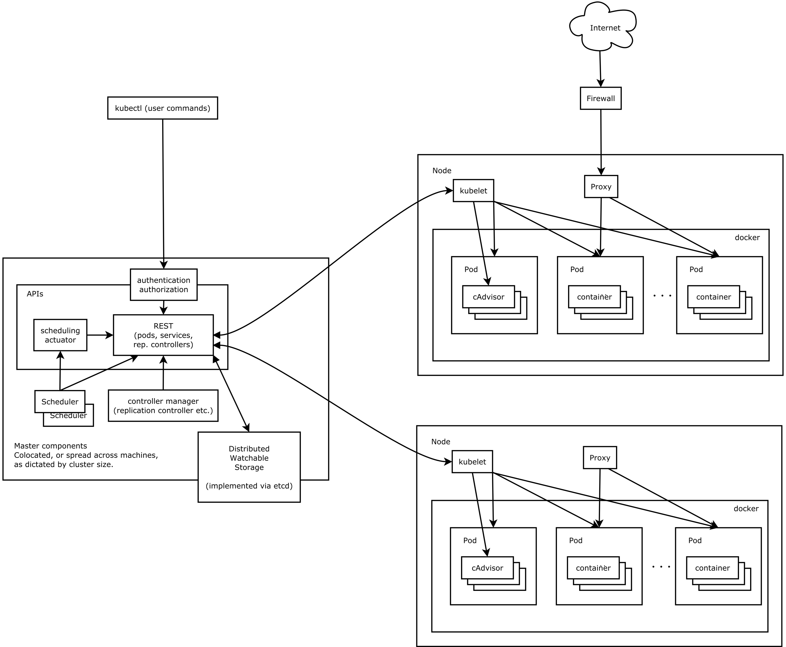


#### 核心组件

- ETCD：分布式高性能键值数据库,存储整个集群的所有元数据

- ApiServer:  API服务器,集群资源访问控制入口,提供restAPI及安全访问控制

- Scheduler：调度器,负责把业务容器调度到最合适的Node节点

- Controller Manager：控制器管理,确保集群资源按照期望的方式运行

  - Replication Controller
  - Node controller
  - ResourceQuota Controller
  - Namespace Controller
  - ServiceAccount Controller
  - Token Controller
  - Service Controller
  - Endpoints Controller

- kubelet：运行在每个节点上的主要的“节点代理”，脏活累活

  - pod 管理：kubelet 定期从所监听的数据源获取节点上 pod/container 的期望状态（运行什么容器、运行的副本数量、网络或者存储如何配置等等），并调用对应的容器平台接口达到这个状态。
  - 容器健康检查：kubelet 创建了容器之后还要查看容器是否正常运行，如果容器运行出错，就要根据 pod 设置的重启策略进行处理.
  - 容器监控：kubelet 会监控所在节点的资源使用情况，并定时向 master 报告，资源使用数据都是通过 cAdvisor 获取的。知道整个集群所有节点的资源情况，对于 pod 的调度和正常运行至关重要

- kube-proxy：维护节点中的iptables或者ipvs规则

- kubectl: 命令行接口，用于对 Kubernetes 集群运行命令  https://kubernetes.io/zh/docs/reference/kubectl/ 

  

#### 工作流程

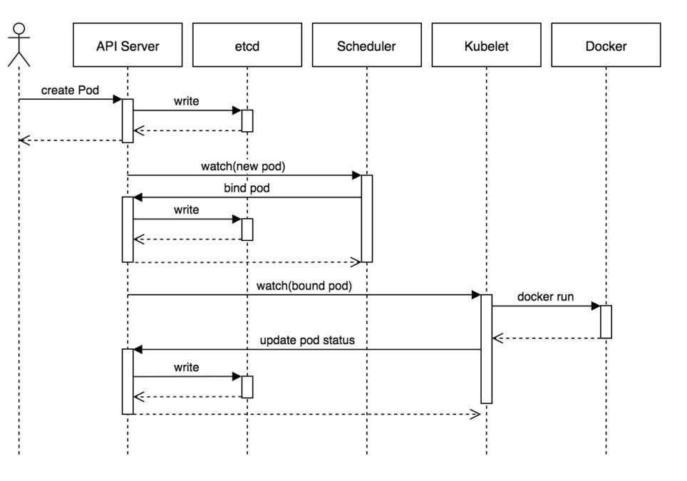

1. 用户准备一个资源文件（记录了业务应用的名称、镜像地址等信息），通过调用APIServer执行创建Pod
2. APIServer收到用户的Pod创建请求，将Pod信息写入到etcd中
3. 调度器通过list-watch的方式，发现有新的pod数据，但是这个pod还没有绑定到某一个节点中
4. 调度器通过调度算法，计算出最适合该pod运行的节点，并调用APIServer，把信息更新到etcd中
5. kubelet同样通过list-watch方式，发现有新的pod调度到本机的节点了，因此调用容器运行时，去根据pod的描述信息，拉取镜像，启动容器，同时生成事件信息
6. 同时，把容器的信息、事件及状态也通过APIServer写入到etcd中

#### 架构设计的几点思考

1. 系统各个组件分工明确(APIServer是所有请求入口，CM是控制中枢，Scheduler主管调度，而Kubelet负责运行)，配合流畅，整个运行机制一气呵成。
2. 除了配置管理和持久化组件ETCD，其他组件并不保存数据。意味`除ETCD外`其他组件都是无状态的。因此从架构设计上对kubernetes系统高可用部署提供了支撑。
3. 同时因为组件无状态，组件的升级，重启，故障等并不影响集群最终状态，只要组件恢复后就可以从中断处继续运行。
4. 各个组件和kube-apiserver之间的数据推送都是通过list-watch机制来实现。

#### 实践--集群安装

###### k8s集群主流安装方式对比分析

- minikube
- 二进制安装
- kubeadm等安装工具

kubeadm  https://kubernetes.io/zh/docs/reference/setup-tools/kubeadm/kubeadm/ 

《Kubernetes安装手册（非高可用版）》

###### 核心组件

静态Pod的方式：

```powershell
## etcd、apiserver、controller-manager、kube-scheduler
$ kubectl -n kube-system get po
```

systemd服务方式：

```powershell
$ systemctl status kubelet

```

kubectl：二进制命令行工具

四大组件：kubelet static pod安装的，根据文件位置自动拉起来

```
[root@k8s-master ~]# ll /etc/kubernetes/manifests/
-rw------- 1 root root 2146 Jun 28 12:00 etcd.yaml
-rw------- 1 root root 3196 Jun 28 12:00 kube-apiserver.yaml
-rw------- 1 root root 2858 Jun 28 12:00 kube-controller-manager.yaml
-rw------- 1 root root 1413 Jun 28 12:00 kube-scheduler.yaml
```

kube-proxy组件：以pod方式启动

```
[root@k8s-master manifests]# kubectl -n kube-system get pod |grep kube-proxy
kube-proxy-4hxpq                     1/1     Running            0          24h
kube-proxy-ng75q                     1/1     Running            0          24h
kube-proxy-nvtqt                     1/1     Running            0          25h
```

kube-proxy是一种组件

pod是一种资源，kube-proxy-4hxpq也是一种资源


###### 理解集群资源

`组件`是为了支撑k8s平台的运行，安装好的软件。

`资源`是如何去使用k8s的能力的定义。比如，k8s可以使用Pod来管理业务应用，那么Pod就是k8s集群中的一类资源，集群中的所有资源可以提供如下方式查看：

```powershell
$ kubectl api-resources
NAME                              SHORTNAMES   APIGROUP                       NAMESPACED   KIND
endpoints                         ep                                          true         Endpoints
events                            ev                                          true         Event
```

NAMESPACE为true，该资源必须指定命名空间

```
# 查看某个资源
[root@k8s-master manifests]# kubectl get namespaces 
```


**如何理解namespace**：

> 命名空间，集群内一个虚拟的概念，类似于资源池的概念，一个池子里可以有各种资源类型，绝大多数的资源都必须属于某一个namespace。集群初始化安装好之后，会默认有如下几个namespace：

```powershell
$ kubectl get namespaces
NAME                   STATUS   AGE
default                Active   84m
kube-node-lease        Active   84m
kube-public            Active   84m
kube-system            Active   84m
kubernetes-dashboard   Active   71m

```

- 所有NAMESPACED的资源，在创建的时候都需要指定namespace，若不指定，默认会在default命名空间下
- 相同namespace下的同类资源不可以重名，不同类型的资源可以重名
- 不同namespace下的同类资源可以重名
- 通常在项目使用的时候，我们会创建带有业务含义的namespace来做逻辑上的整合


```python
# 查看namespace下的pod
[root@k8s-master manifests]# kubectl get po -n kube-system 
NAME                                 READY   STATUS             RESTARTS   AGE
coredns-6d56c8448f-lqcs4             0/1     CrashLoopBackOff   9          25h
coredns-6d56c8448f-m8678             0/1     CrashLoopBackOff   9          25h
etcd-k8s-master                      1/1     Running            0          25h


# 在配置文件中指定pod的namespace
cat /etc/kubernetes/manifests/kube-apiserver.yaml 
```


###### kubectl的使用

类似于docker，kubectl是命令行工具，用于与APIServer交互，内置了丰富的子命令，功能极其强大。 https://kubernetes.io/docs/reference/kubectl/overview/ 

```powershell
$ kubectl -h
$ kubectl get -h
$ kubectl create -h
$ kubectl create namespace -h

# 创建luffy
[root@k8s-master ~]# kubectl create namespace luffy
```


#### 实践--使用k8s管理业务应用        

##### 最小调度单元 Pod

docker调度的是容器，在k8s集群中，最小的调度单元是Pod（豆荚）

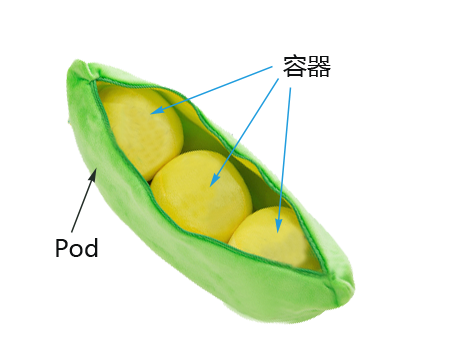

###### 为什么引入Pod

- 与容器引擎解耦

  Docker、Rkt。平台设计与引擎的具体的实现解耦

- 多容器共享网络|存储|进程 空间, 支持的业务场景更加灵活

###### 使用yaml格式定义Pod

*myblog/one-pod/pod.yaml*

理解，不能直接复制粘贴

```yaml
apiVersion: v1
kind: Pod
metadata:
  name: myblog
  namespace: luffy
  labels:
    component: myblog
spec:
  containers:
  - name: myblog
    image: 192.168.150.128:5000/myblog:v1
    env:
    - name: MYSQL_HOST   #  指定root用户的用户名
      value: "127.0.0.1"  # 在1个pod的容器，可以通过localhost访问
    - name: MYSQL_PASSWD
      value: "123456"
    ports:
    - containerPort: 8002  # 象征意义，不在这里设置
  - name: mysql
    image: mysql:5.7
    # command: /bin/bash    # entrypoint的转换
    args:  
    - --character-set-server=utf8mb4   # cmd的参数
    - --collation-server=utf8mb4_unicode_ci
    ports:
    - containerPort: 3306
    env:
    - name: MYSQL_ROOT_PASSWORD
      value: "123456"
    - name: MYSQL_DATABASE
      value: "myblog"

```

```json
{
    "apiVersion": "v1",
    "kind": "Pod",
    "metadata": {
        "name": "myblog",
        "namespace": "luffy",
        "labels": {
            "component": "myblog"
        }
    },
    "spec": {
        "containers": [
            {
                "name": "myblog",
                "image": "172.21.51.143:5000/myblog:v1",
                "env": [
                    {
                        "name": "MYSQL_HOST",
                        "value": "127.0.0.1"
                    }
                ]
            },
            {
                ...
            }
        ]
    }
}
```

`正确测试的`

```
apiVersion: v1
kind: Pod
metadata:
  name: myblog
  namespace: luffy
  labels:
    component: myblog
spec:
  containers:
  - name: myblog
    image: 192.168.150.128:5000/myblog:v1
    env:
    - name: MYSQL_HOST
      value: "127.0.0.1"
    - name: MYSQL_PASSWD
      value: "123456"
    ports:
    - containerPort: 8002
  - name: mysql
    image: mysql:5.7
    args:
    - --character-set-server=utf8mb4
    - --collation-server=utf8mb4_unicode_ci
    ports:
    - containerPort: 3306
    env:
    - name: MYSQL_ROOT_PASSWORD
      value: "123456"
    - name: MYSQL_DATABASE
      value: "myblog"
```


apiVersion：资源的成熟度

| apiVersion | 含义                                                         |
| :--------- | :----------------------------------------------------------- |
| alpha      | 进入K8s功能的早期候选版本，可能包含Bug，最终不一定进入K8s    |
| beta       | 已经过测试的版本，最终会进入K8s，但功能、对象定义可能会发生变更。 |
| stable     | 可安全使用的稳定版本                                         |
| v1         | stable 版本之后的首个版本，包含了更多的核心对象              |
| apps/v1    | 使用最广泛的版本，像Deployment、ReplicaSets都已进入该版本    |

资源类型与apiVersion对照表

| Kind                  | apiVersion                              |
| :-------------------- | :-------------------------------------- |
| ClusterRoleBinding    | rbac.authorization.k8s.io/v1            |
| ClusterRole           | rbac.authorization.k8s.io/v1            |
| ConfigMap             | v1                                      |
| CronJob               | batch/v1beta1                           |
| DaemonSet             | extensions/v1beta1                      |
| Node                  | v1                                      |
| Namespace             | v1                                      |
| Secret                | v1                                      |
| PersistentVolume      | v1                                      |
| PersistentVolumeClaim | v1                                      |
| Pod                   | v1                                      |
| Deployment            | v1、apps/v1、apps/v1beta1、apps/v1beta2 |
| Service               | v1                                      |
| Ingress               | extensions/v1beta1                      |
| ReplicaSet            | apps/v1、apps/v1beta2                   |
| Job                   | batch/v1                                |
| StatefulSet           | apps/v1、apps/v1beta1、apps/v1beta2     |

快速获得资源和版本

```powershell
$ kubectl explain pod
$ kubectl explain Pod.apiVersion

```

###### 创建和访问Pod

```powershell
## 创建namespace, namespace是逻辑上的资源池
$ kubectl create namespace luffy

# 回顾docker部署本地镜像，推送myblog和mysql两个镜像到registry中，再生成
# docker tag mysql:5.7 192.168.150.128:5000/mysql:5.7
# docker tag myblog:v1 192.168.150.128:5000/myblog:v1
# docker push 192.168.150.128:5000/mysql:5.7 
# docker push 192.168.150.128:5000/myblog:v1
# curl -X GET http://192.168.150.128:5000/v2/_catalog


## 使用指定文件创建Pod
$ kubectl create -f pod.yaml

## 查看pod，可以简写po
## 所有的操作都需要指定namespace，如果是在default命名空间下，则可以省略
$ kubectl -n luffy get pods -o wide
NAME     READY   STATUS    RESTARTS   AGE    IP             NODE
myblog   2/2     Running   0          3m     10.244.1.146   k8s-slave1

# 回顾，docker部署django项目流程


## 使用Pod Ip访问服务,3306和8002
$ curl 10.244.1.146:8002/blog/index/

## 进入容器,执行初始化, 不必到对应的主机执行docker exec
# 进入myblog容器
$ kubectl -n luffy exec -ti myblog -c myblog bash
$ ifconfig
$ ps aux
/ # env
/ # python3 manage.py migrate

# 进入mysql容器
$ kubectl -n luffy exec -ti myblog -c mysql bash
/ # mysql -p123456

## 再次访问服务,3306和8002，
$ curl 10.244.1.146:8002/blog/index/

!!! 注意这一步无法访问到数据时，
!!! 虚拟机重启。应该可以的
```

###### Infra容器：基础设施容器

登录`k8s-slave1`节点

infra容器，为了实现pod内部互相以localhost通信。Docker的网络container模式

```powershell
$ docker ps -a |grep myblog  ## 发现有三个容器
## 其中包含mysql和myblog程序以及Infra容器

## 为了实现Pod内部的容器可以通过localhost通信，每个Pod都会启动Infra容器，然后Pod内部的其他容器的网络空间会共享该Infra容器的网络空间(Docker网络的container模式，docker run --net=infra)，Infra容器只需要hang住网络空间，不需要额外的功能，因此资源消耗极低。

## 登录master节点，查看pod内部的容器ip均相同，为pod ip
$ kubectl -n luffy exec -ti myblog -c myblog bash
/ # ifconfig
$ kubectl -n luffy exec -ti myblog -c mysql bash
/ # ifconfig

```

pod容器命名: ```k8s_<container_name>_<pod_name>_<namespace>_<random_string>```


###### 查看pod详细信息（常用）

```powershell
## 查看pod调度节点及pod_ip
$ kubectl -n luffy get pods -o wide

## 查看完整的yaml
$ kubectl -n luffy get po myblog -o yaml

## pod正在启动，查看pod的明细信息及事件
$ kubectl -n luffy describe pod myblog

```


###### Troubleshooting and Debugging（常用）

```powershell
#进入Pod内的容器
$ kubectl -n <namespace> exec <pod_name> -c <container_name> -ti /bin/sh
# kubectl -n luffy exec -ti myblog -c mysql /bin/sh

#查看Pod内容器日志,显示标准或者错误输出日志
$ kubectl -n <namespace> logs -f <pod_name> -c <container_name>
$ kubectl -n <namespace> logs -f --tail=100 <pod_name> -c <container_name>
# kubectl -n luffy logs -f myblog -c mysql
# kubectl -n luffy logs -f --tail=100 myblog -c mysql

# pod启动失败。查看日志
$ kubectl -n luffy logs -f myblog -c myblog
$ kubectl -n luffy logs -f myblog -c mysql
```


###### 删除Pod服务（常用）

```powershell
#根据文件删除
$ kubectl delete -f demo-pod.yaml

#根据pod_name删除
$ kubectl -n <namespace> delete pod <pod_name>
# kubectl -n luffy delete pod myblog
```


###### 更新服务版本

```powershell
# v1-->v2版本
vim myblog.pod.yaml

# 删除pod服务
kubectl delete -f myblog.pod.yaml
# 或者
kubectl -n luffy delete pod myblog


$ kubectl apply -f demo-pod.yaml

```


###### Pod数据持久化

若删除了Pod，由于mysql的数据都在容器内部，会造成数据丢失，因此需要数据进行持久化。

- 定点使用hostpath挂载，nodeSelector定点

  `myblog/one-pod/pod-with-volume.yaml`

  ```yaml
  apiVersion: v1
  kind: Pod
  metadata:
    name: myblog
    namespace: luffy
    labels:
      component: myblog
  spec:
    volumes:  # 定义1个卷
    - name: mysql-data
      hostPath: 
        path: /opt/mysql/data  # 宿主机的目录
    nodeSelector:   # 使用节点选择器将Pod调度到指定label的节点
      component: mysql  # 需要给节点，比如k8s-slave1打标签
    containers:
    - name: myblog
      image: 172.21.51.143:5000/myblog:v1
      env:
      - name: MYSQL_HOST  
        value: "127.0.0.1"
      - name: MYSQL_PASSWD
        value: "123456"
      ports:
      - containerPort: 8002
    - name: mysql
      image: mysql:5.7
      args:
      - --character-set-server=utf8mb4
      - --collation-server=utf8mb4_unicode_ci
      ports:
      - containerPort: 3306
      env:
      - name: MYSQL_ROOT_PASSWORD
        value: "123456"
      - name: MYSQL_DATABASE
        value: "myblog"
      volumeMounts:  # 挂载卷
      - name: mysql-data
        mountPath: /var/lib/mysql
  
  
  ```

  保存文件为`pod-with-volume.yaml`，执行创建

  ```powershell
  
  ## 若存在旧的同名服务，先删除掉，后创建
  $ kubectl -n luffy delete pod myblog
  ## 创建
  $ kubectl create -f pod-with-volume.yaml
  
  # 更新失败,在原文件修改
  # 以yaml更新pod，必须修改某些指定的值
  # kubectl apply -f demo-pod.yaml
  
  ## 此时pod状态Pending
  $ kubectl -n luffy get po
  NAME     READY   STATUS    RESTARTS   AGE
  myblog   0/2     Pending   0          32s
  
  ## 查看原因，提示调度失败，因为节点不满足node selector，node选择器
  $ kubectl -n luffy describe po myblog
  Events:
    Type     Reason            Age                From               Message
    ----     ------            ----               ----               -------
    Warning  FailedScheduling  12s (x2 over 12s)  default-scheduler  0/3 nodes are available: 3 node(s) didn't match node selector.
    
  ## 为节点打标签component=mysql，配置文件写的
  $ kubectl label node k8s-slave1 component=mysql
  
  ## 再次查看，已经运行成功 (快速更改status，list-watch机制)
  $ kubectl -n luffy get po
  NAME     READY   STATUS    RESTARTS   AGE     IP             NODE
  myblog   2/2     Running   0          3m54s   10.244.1.150   k8s-slave1
  
  ## 到k8s-slave1节点，查看/opt/mysql/data
  $ ll /opt/mysql/
  total 188484
  -rw-r----- 1 polkitd input       56 Mar 29 09:20 auto.cnf
  -rw------- 1 polkitd input     1676 Mar 29 09:20 ca-key.pem
  -rw-r--r-- 1 polkitd input     1112 Mar 29 09:20 ca.pem
  drwxr-x--- 2 polkitd input     8192 Mar 29 09:20 sys
  ...
  
  ## 执行migrate，创建数据库表，然后删掉pod，再次创建后验证数据是否存在
  $ kubectl -n luffy exec -ti myblog python3 manage.py migrate
  
  ## 访问服务，正常
  $ curl 10.244.1.150:8002/blog/index/ 
  
  ## 删除pod
  $ kubectl delete -f pod-with-volume.yaml
  
  ## 再次创建Pod
  $ kubectl create -f pod-with-volume.yaml
  
  ## 查看pod ip并访问服务
  $ kubectl -n luffy get po -o wide
  NAME     READY   STATUS    RESTARTS   AGE   IP             NODE  
  myblog   2/2     Running   0          7s    10.244.1.151   k8s-slave1
  
  ## 未重新做migrate，服务正常
  $ curl 10.244.1.151:8002/blog/index/
  
  ```

- 使用PV+PVC连接分布式存储解决方案

  - ceph
  - glusterfs
  - nfs

###### 服务健康检查

检测容器服务是否健康的手段，若不健康，会根据设置的重启策略（restartPolicy）进行操作，两种检测机制可以分别单独设置，若不设置，默认认为Pod是健康的。

两种机制：

- LivenessProbe探针
  存活性探测：`用于判断容器是否存活，即Pod是否为running状态`，如果LivenessProbe探针探测到容器不健康，则kubelet将kill掉容器，并根据容器的重启策略是否重启，如果一个容器不包含LivenessProbe探针，则Kubelet认为容器的LivenessProbe探针的返回值永远成功。 

  ```yaml
  ...
    containers:
    - name: myblog
      image: 172.21.51.143:5000/myblog:v1
      livenessProbe:
        httpGet:
          path: /blog/index/
          port: 8002
          scheme: HTTP
        initialDelaySeconds: 10  # 容器启动后第一次执行探测是需要等待多少秒
        periodSeconds: 10 	# 执行探测的频率
        timeoutSeconds: 2		# 探测超时时间
  ...
  ```

  

  

  - ReadinessProbe探针
    可用性探测：`用于判断容器是否正常提供服务，即容器的Ready是否为True，`是否可以接收请求，如果ReadinessProbe探测失败，则容器的Ready将为False， Endpoint Controller 控制器将此Pod的Endpoint从对应的service的Endpoint列表中移除，不再将任何请求调度此Pod上，直到下次探测成功。（剔除此pod不参与接收请求不会将流量转发给此Pod）。
  
  ```yaml
  ...
    containers:
    - name: myblog
      image: 172.21.51.143:5000/myblog:v1
      readinessProbe: 
        httpGet: 
          path: /blog/index/
          port: 8002
          scheme: HTTP
        initialDelaySeconds: 10 
        timeoutSeconds: 2
        periodSeconds: 10
  ...
  
  ```
  
  
  
  

三种类型：

- exec：通过执行命令来检查服务是否正常，返回值为0则表示容器健康
- httpGet方式：通过发送http请求检查服务是否正常，返回200-399状态码则表明容器健康
- tcpSocket：通过容器的IP和Port执行TCP检查，如果能够建立TCP连接，则表明容器健康

示例：

完整文件路径 `myblog/one-pod/pod-with-healthcheck.yaml`

给mysql-myblog.yaml，添加如下配置

```yaml
  ...
  containers:
  - name: myblog
    image: 192.168.150.128:5000/myblog:v1
    env:
    - name: MYSQL_HOST   #  指定root用户的用户名
      value: "127.0.0.1"
    - name: MYSQL_PASSWD
      value: "123456"
    ports:
    - containerPort: 8002
    livenessProbe:   # 是否存活探针
      httpGet:       # httpGet方式
        path: /blog/index/
        port: 8002
        scheme: HTTP
      initialDelaySeconds: 10  # 容器启动后第一次执行探测是需要等待多少秒
      periodSeconds: 10 	# 执行探测的频率
      timeoutSeconds: 2		# 探测超时时间
    readinessProbe:   # ready探针
      httpGet: 
        path: /blog/index/
        port: 8002
        scheme: HTTP
      initialDelaySeconds: 10 
      timeoutSeconds: 2
      periodSeconds: 10


```

- initialDelaySeconds：容器启动后第一次执行探测是需要等待多少秒。
- periodSeconds：执行探测的频率。默认是10秒，最小1秒。
- timeoutSeconds：探测超时时间。默认1秒，最小1秒。
- successThreshold：探测失败后，最少连续探测成功多少次才被认定为成功。默认是1。
- failureThreshold：探测成功后，最少连续探测失败多少次
  才被认定为失败。默认是3，最小值是1。

K8S将在Pod开始**启动10s(initialDelaySeconds)后**利用HTTP访问8002端口的/blog/index/，如果**超过2s**或者返回码不在200~399内，则健康检查失败

```python

# 查看日志详细信息：
[root@k8s-master one-pod]# kubectl -n luffy describe pod myblog

  Normal   Started    63s                kubelet            Started container mysql
  Warning  Unhealthy  26s (x3 over 46s)  kubelet            Liveness probe failed: HTTP probe failed with statuscode: 500
  Normal   Killing    26s                kubelet            Container myblog failed liveness probe, will be restarted
  Warning  Unhealthy  1s (x6 over 51s)   kubelet            Readiness probe failed: HTTP probe failed with statuscode: 500


# 查看pod 
[root@k8s-master one-pod]# kubectl -n luffy get po -o wide --watch
NAME     READY   STATUS    RESTARTS   AGE   IP            NODE         NOMINATED NODE   READINESS GATES
myblog   1/2     Running   1          90s   10.240.1.11   k8s-slave1   <none>           <none>

# 进入myblog执行migrate命令
$ kubectl -n luffy exec -ti myblog python3 manage.py migrate

# 查看 READY为2
[root@k8s-master one-pod]# kubectl -n luffy get po -o wide --watch
NAME     READY   STATUS    RESTARTS   AGE     IP            NODE         NOMINATED NODE   READINESS GATES
myblog   2/2     Running   3          3m47s   10.240.1.11   k8s-slave1   <none>           <none>

```


###### pod重启策略

Pod的重启策略（RestartPolicy）应用于Pod内的所有容器，并且仅在Pod所处的Node上由kubelet进行判断和重启操作。当某个容器异常退出或者健康检查失败时，kubelet将根据RestartPolicy的设置来进行相应的操作。
 Pod的重启策略包括Always、OnFailure和Never，默认值为Always。

- Always：当容器进程退出后，由kubelet自动重启该容器；
- OnFailure：当容器终止运行且退出码不为0时，由kubelet自动重启该容器；
- Never：不论容器运行状态如何，kubelet都不会重启该容器。

演示重启策略：

```yaml
# 创建yaml文件
[root@k8s-master one-pod]# vim test-restart.yaml
apiVersion: v1
kind: Pod
metadata:
  name: test-restart-policy
spec:
  restartPolicy: Always  # 重启策略
  containers:
  - name: busybox
    image: busybox
    args:
    - /bin/sh
    - -c
    - sleep 10


# 创建并查看pod状态
[root@k8s-master one-pod]# kubectl apply -f test-restart.yaml 
[root@k8s-master one-pod]# kubectl  get po -o wide -w
NAME                  READY   STATUS              RESTARTS   AGE   IP           NODE         NOMINATED NODE   READINESS GATES
test-restart-policy   0/1     Completed           0          40s   10.240.2.4   k8s-slave2   <none>           <none>
test-restart-policy   1/1     Running             1          56s   10.240.2.4   k8s-slave2   <none>           <none>


```

1. 使用默认的重启策略，即 restartPolicy: Always ，无论容器是否是正常退出，都会自动重启容器
2. 使用OnFailure的策略时
   - 如果把exit 1，去掉，即让容器的进程正常退出的话，则不会重启
   - 只有非正常退出状态才会重启
3. 使用Never时，退出了就不再重启

可以看出，若容器正常退出，Pod的状态会是Completed，非正常退出，状态为CrashLoopBackOff

###### 镜像拉取策略

```yaml
spec:
  containers:
  - name: myblog
    image: 172.21.51.143:5000/myblog:v1
    imagePullPolicy: IfNotPresent


```

设置镜像的拉取策略，默认为IfNotPresent

- Always，总是拉取镜像，即使本地有镜像也从仓库拉取
- `IfNotPresent ，本地有则使用本地镜像`，本地没有则去仓库拉取，默认策略
- Never，只使用本地镜像，本地没有则报错

###### Pod资源限制

为了保证充分利用集群资源，且确保重要容器在运行周期内能够分配到足够的资源稳定运行，因此平台需要具备

Pod的资源限制的能力。 对于一个pod来说，资源最基础的2个的指标就是：CPU和内存。

Kubernetes提供了个采用requests和limits 两种类型参数对资源进行预分配和使用限制。

完整文件路径：`myblog/one-pod/pod-with-resourcelimits.yaml`

```yaml
...
  containers:
  - name: myblog
    image: 172.21.51.143:5000/myblog:v1
    env:
    - name: MYSQL_HOST   #  指定root用户的用户名
      value: "127.0.0.1"
    - name: MYSQL_PASSWD
      value: "123456"
    ports:
    - containerPort: 8002
    resources:
      requests:
        memory: 100Mi
        cpu: 50m
      limits:
        memory: 500Mi
        cpu: 100m
...


```

requests：

- 容器使用的最小资源需求,作用于schedule阶段，作为容器调度时资源分配的判断依赖
- 只有当前节点上可分配的资源量 >= request 时才允许将容器调度到该节点
- request参数不限制容器的最大可使用资源
- requests.cpu被转成docker的--cpu-shares参数，与cgroup cpu.shares功能相同 (无论宿主机有多少个cpu或者内核，--cpu-shares选项都会按照比例分配cpu资源）
- requests.memory没有对应的docker参数，仅作为k8s调度依据

limits：

- 容器能使用资源的最大值
- 设置为0表示对使用的资源不做限制, 可无限的使用
- 当pod 内存超过limit时，会被oom
- 当cpu超过limit时，不会被kill，但是会限制不超过limit值
- limits.cpu会被转换成docker的–cpu-quota参数。与cgroup cpu.cfs_quota_us功能相同
- limits.memory会被转换成docker的–memory参数。用来限制容器使用的最大内存

 对于 CPU，我们知道计算机里 CPU 的资源是按`“时间片”`的方式来进行分配的，系统里的每一个操作都需要 CPU 的处理，所以，哪个任务要是申请的 CPU 时间片越多，那么它得到的 CPU 资源就越多。

然后还需要了解下 CGroup 里面对于 CPU 资源的单位换算：

```shell
1 CPU =  1000 millicpu（1 Core = 1000m）


```

 这里的 `m` 就是毫、毫核的意思，Kubernetes 集群中的每一个节点可以通过操作系统的命令来确认本节点的 CPU 内核数量，然后将这个数量乘以1000，得到的就是节点总 CPU 总毫数。比如一个节点有四核，那么该节点的 CPU 总毫量为 4000m。 

`docker run`命令和 CPU 限制相关的所有选项如下：

| 选项                  | 描述                                                    |
| --------------------- | ------------------------------------------------------- |
| `--cpuset-cpus=""`    | 允许使用的 CPU 集，值可以为 0-3,0,1                     |
| `-c`,`--cpu-shares=0` | CPU 共享权值（相对权重）                                |
| `cpu-period=0`        | 限制 CPU CFS 的周期，范围从 100ms~1s，即[1000, 1000000] |
| `--cpu-quota=0`       | 限制 CPU CFS 配额，必须不小于1ms，即 >= 1000，绝对限制  |

```shell
docker run -it --cpu-period=50000 --cpu-quota=25000 ubuntu:16.04 /bin/bash


```

将 CFS 调度的周期设为 50000，将容器在每个周期内的 CPU 配额设置为 25000，表示该容器每 50ms 可以得到 50% 的 CPU 运行时间。

> 注意：若内存使用超出限制，会引发系统的OOM机制，因CPU是可压缩资源，不会引发Pod退出或重建


测试demo

```python
# 查看node的request和limit
[root@k8s-master one-pod]# kubectl describe node k8s-slave1 
  Resource           Requests   Limits
  --------           --------   ------
  cpu                100m (5%)  100m (5%)
  memory             50Mi (2%)  50Mi (2%)


# 修改yaml文件，reques为100G

# 删除旧pod，create新的pod
[root@k8s-master one-pod]# kubectl apply -f pod.yaml 

# 查看pod的详细信息。内存不足
[root@k8s-master one-pod]# kubectl -n luffy describe pod myblog
Events:
  Type     Reason            Age   From               Message
  ----     ------            ----  ----               -------
  Warning  FailedScheduling  63s   default-scheduler  0/3 nodes are available: 3 Insufficient memory.
  Warning  FailedScheduling  63s   default-scheduler  0/3 nodes are available: 3 Insufficient memory.
```


###### yaml优化，单一pod，配置文件

目前完善后的yaml，`myblog/one-pod/pod-completed.yaml`

```yaml
apiVersion: v1
kind: Pod
metadata:
  name: myblog
  namespace: luffy
  labels:
    component: myblog
spec:
  volumes: 
  - name: mysql-data
    hostPath: 
      path: /opt/mysql/data
  nodeSelector:   # 使用节点选择器将Pod调度到指定label的节点
    component: mysql
  containers:
  - name: myblog
    image: 172.21.51.143:5000/myblog:v1
    env:
    - name: MYSQL_HOST   #  指定root用户的用户名
      value: "127.0.0.1"
    - name: MYSQL_PASSWD
      value: "123456"
    ports:
    - containerPort: 8002
    resources:
      requests:
        memory: 100Mi
        cpu: 50m
      limits:
        memory: 500Mi
        cpu: 100m
    livenessProbe:
      httpGet:
        path: /blog/index/
        port: 8002
        scheme: HTTP
      initialDelaySeconds: 10  # 容器启动后第一次执行探测是需要等待多少秒
      periodSeconds: 15 	# 执行探测的频率
      timeoutSeconds: 2		# 探测超时时间
    readinessProbe: 
      httpGet: 
        path: /blog/index/
        port: 8002
        scheme: HTTP
      initialDelaySeconds: 10 
      timeoutSeconds: 2
      periodSeconds: 15
  - name: mysql
    image: mysql:5.7
    args:
    - --character-set-server=utf8mb4
    - --collation-server=utf8mb4_unicode_ci
    ports:
    - containerPort: 3306
    env:
    - name: MYSQL_ROOT_PASSWORD
      value: "123456"
    - name: MYSQL_DATABASE
      value: "myblog"
    resources:
      requests:
        memory: 100Mi
        cpu: 50m
      limits:
        memory: 500Mi
        cpu: 100m
    readinessProbe:
      tcpSocket:
        port: 3306
      initialDelaySeconds: 5
      periodSeconds: 10
    livenessProbe:
      tcpSocket:
        port: 3306
      initialDelaySeconds: 15
      periodSeconds: 20
    volumeMounts:
    - name: mysql-data
      mountPath: /var/lib/mysql


```

> 为什么要优化？

- 考虑真实的使用场景，像数据库这类中间件，是作为公共资源，为多个项目提供服务，不适合和业务容器绑定在同一个Pod中，因为业务容器是经常变更的，而数据库不需要频繁迭代 `拆分mysql、myblog`
- yaml的环境变量中存在敏感信息（账号、密码），存在安全隐患

解决问题一，需要拆分yaml

`myblog/two-pod/mysql.yaml`

```yaml
apiVersion: v1
kind: Pod
metadata:
  name: mysql
  namespace: luffy
  labels:
    component: mysql
spec:
  hostNetwork: true	# 声明pod的网络模式为host模式，效果同docker run --net=host
  volumes: 
  - name: mysql-data
    hostPath: 
      path: /opt/mysql/data
  nodeSelector:   # 使用节点选择器将Pod调度到指定label的节点
    component: mysql
  containers:
  - name: mysql
    image: mysql:5.7
    args:
    - --character-set-server=utf8mb4
    - --collation-server=utf8mb4_unicode_ci
    ports:
    - containerPort: 3306
    env:
    - name: MYSQL_ROOT_PASSWORD
      value: "123456"
    - name: MYSQL_DATABASE
      value: "myblog"
    resources:
      requests:
        memory: 100Mi
        cpu: 50m
      limits:
        memory: 500Mi
        cpu: 100m
    readinessProbe:
      tcpSocket:
        port: 3306
      initialDelaySeconds: 5
      periodSeconds: 10
    livenessProbe:
      tcpSocket:
        port: 3306
      initialDelaySeconds: 15
      periodSeconds: 20
    volumeMounts:
    - name: mysql-data
      mountPath: /var/lib/mysql


```

myblog.yaml

```yaml
apiVersion: v1
kind: Pod
metadata:
  name: myblog
  namespace: luffy
  labels:
    component: myblog
spec:
  containers:
  - name: myblog
    image: 192.168.150.128:5000/myblog:v1
    imagePullPolicy: IfNotPresent
    env:
    - name: MYSQL_HOST   #  指定root用户的用户名
      value: "192.168.150.128"   # 暂时填写mysql的pod的ip
    - name: MYSQL_PASSWD
      value: "123456"
    ports:
    - containerPort: 8002
    resources:
      requests:
        memory: 100Mi
        cpu: 50m
      limits:
        memory: 500Mi
        cpu: 100m
    livenessProbe:
      httpGet:
        path: /blog/index/
        port: 8002
        scheme: HTTP
      initialDelaySeconds: 10  # 容器启动后第一次执行探测是需要等待多少秒
      periodSeconds: 15 	# 执行探测的频率
      timeoutSeconds: 2		# 探测超时时间
    readinessProbe: 
      httpGet: 
        path: /blog/index/
        port: 8002
        scheme: HTTP
      initialDelaySeconds: 10 
      timeoutSeconds: 2
      periodSeconds: 15

```

创建测试

```powershell
## 先删除旧pod
$ kubectl -n luffy delete po myblog

## 分别创建mysql和myblog
$ kubectl create -f mysql.yaml
$ kubectl create -f myblog.yaml

## 查看pod，
！！注意mysqlIP为宿主机IP，因为网络模式为host
$ kubectl -n luffy get po -o wide 
NAME     READY   STATUS    RESTARTS   AGE   IP                NODE
myblog   1/1     Running   0          41s   10.244.1.152      k8s-slave1
mysql    1/1     Running   0          52s   172.21.51.67   k8s-slave1

## 访问myblog服务正常
$ curl 10.244.1.152:8002/blog/index/

## 访问mysql服务
curl 192.168.150.129:3306
```

######  环境变量，密码管理

解决问题二，环境变量中敏感信息带来的安全隐患

为什么要统一管理环境变量

- 环境变量中有很多敏感的信息，比如账号密码，直接暴漏在yaml文件中存在安全性问题
- 团队内部一般存在多个项目，这些项目直接存在配置相同环境变量的情况，因此可以统一维护管理
- 对于开发、测试、生产环境，由于配置均不同，每套环境部署的时候都要修改yaml，带来额外的开销

k8s提供两类资源，configMap和Secret，可以用来实现业务配置的统一管理， 允许将配置文件与镜像文件分离，以使容器化的应用程序具有可移植性 。

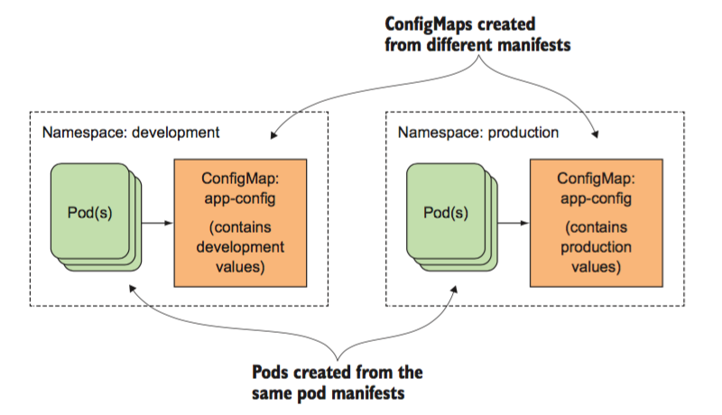

- configMap，通常用来管理应用的配置文件或者环境变量，`myblog/two-pod/configmap.yaml`

  ```yaml
  apiVersion: v1
  kind: ConfigMap
  metadata:
    name: myblog
    namespace: luffy
  data:
    MYSQL_HOST: "192.168.150.130"
    MYSQL_PORT: "3306"
  
  
  ```

  创建并查看configMap：

  ```powershell
  $ kubectl create -f configmap.yaml
  $ kubectl -n luffy get configmaps myblog -oyaml
  
  ```

  或者可以使用命令的方式，从文件中创建，比如：

  configmap.txt

  ```powershell
  # 创建环境变量类型的
  $ cat configmap.txt
  MYSQL_HOST=192.168.150.130
  MYSQL_PORT=3306
  
  # 没有设置namebase~！！！！
  $ kubectl -n luffy create configmap myblog --from-env-file=configmap.txt
  
  # 查看配置好的configmaps
  [root@k8s-master two-pods]# kubectl -n luffy get configmaps 
  NAME     DATA   AGE
  myblog   2      113s
  [root@k8s-master two-pods]# kubectl -n luffy describe configmaps 
  Data
  ====
  MYSQL_HOST:
  ----
  192.168.150.130
  MYSQL_PORT:
  ----
  3306
  
  ```


```python
# 创建配置文件的
vim mysql.ini

$ kubectl create configmap myblog --from-file=mysql.ini
```


- Secret，管理敏感类的信息，默认会base64编码存储，有三种类型

  - Service Account ：用来访问Kubernetes API，由Kubernetes自动创建，并且会自动挂载到Pod的/run/secrets/kubernetes.io/serviceaccount目录中；创建ServiceAccount后，Pod中指定serviceAccount后，自动创建该ServiceAccount对应的secret；
  - Opaque ： `base64编码格式的Secret`，用来存储密码、密钥等；
  - kubernetes.io/dockerconfigjson ：用来存储私有docker registry的认证信息。

  `myblog/two-pod/secret.yaml`

  ```yaml
  apiVersion: v1
  kind: Secret
  metadata:
    name: myblog
    namespace: luffy
  type: Opaque
  data:
    MYSQL_USER: cm9vdA==		#注意加-n参数， echo -n root|base64
    MYSQL_PASSWD: MTIzNDU2
  
  
  ```

  创建并查看：

  ```powershell
  $ kubectl create -f secret.yaml
  $ kubectl -n luffy get secret
  ```
  
  如果不习惯这种方式，可以通过如下方式：

  ```powershell
  $ cat secret.txt
  MYSQL_USER=root
  MYSQL_PASSWD=123456
  $ kubectl -n luffy create secret generic myblog --from-env-file=secret.txt 
  
  # 查看配置好的secret
  $ kubectl -n luffy describe secrte myblog
  $ kubectl -n luffy describe get secrte myblog -oyaml
  ```

- 完整的yaml文件

整体修改后的mysql的yaml，资源路径：`myblog/two-pod/mysql-with-config.yaml`

```yaml
apiVersion: v1
kind: Pod
metadata:
  name: mysql
  namespace: luffy
  labels:
    component: mysql
spec:
  hostNetwork: true   
  volumes: 
  - name: mysql-data
    hostPath: 
      path: /opt/mysql/data
  nodeSelector:  
    component: mysql
  containers:
  - name: mysql
    image: mysql:5.7
    args:
    - --character-set-server=utf8mb4
    - --collation-server=utf8mb4_unicode_ci
    ports:
    - containerPort: 3306
    env:
    - name: MYSQL_DATABASE
      value: "myblog"
    - name: MYSQL_USER
      valueFrom:
        secretKeyRef:
          name: myblog      # secret
          key: MYSQL_USER   # secret中的key
    - name: MYSQL_ROOT_PASSWORD
      valueFrom:
        secretKeyRef:
          name: myblog        # secret
          key: MYSQL_PASSWD   # secret中的key
    resources:
      requests:
        memory: 100Mi
        cpu: 50m
      limits:
        memory: 500Mi
        cpu: 100m
    readinessProbe:
      tcpSocket:
        port: 3306
      initialDelaySeconds: 5
      periodSeconds: 10
    livenessProbe:
      tcpSocket:
        port: 3306
      initialDelaySeconds: 15
      periodSeconds: 20
    volumeMounts:
    - name: mysql-data
      mountPath: /var/lib/mysql


```

启动mysql的pod，查看ip

修改configMap的ip为此mysql的podIp

然后编辑myblog的yaml启动

!!! 问题：此时mysql的ip还是不断变化的，如何在config中配置ok的mysql的hostIp

```shell
# 删除旧的pod
[root@k8s-master two-pod]# kubectl -n luffy delete pod mysql 

# 根据scret启动新的mysql的pod，此时ip为指定的ip地址
[root@k8s-master two-pod]# kubectl create -f mysql-with-secret.yaml 
pod/mysql created
```


整体修改后的myblog的yaml，资源路径：`myblog/two-pod/myblog-with-config.yaml`

```yaml
apiVersion: v1
kind: Pod
metadata:
  name: myblog
  namespace: luffy
  labels:
    component: myblog
spec:
  containers:
  - name: myblog
    image: 172.21.51.143:5000/myblog:v1
    imagePullPolicy: IfNotPresent
    env:
    - name: MYSQL_HOST
      valueFrom:
        configMapKeyRef:   # configmap1
          name: myblog
          key: MYSQL_HOST   # key
    - name: MYSQL_PORT
      valueFrom:
        configMapKeyRef:
          name: myblog
          key: MYSQL_PORT
    - name: MYSQL_USER
      valueFrom:  
        secretKeyRef:    # secret2
          name: myblog
          key: MYSQL_USER   # key
    - name: MYSQL_PASSWD
      valueFrom:
        secretKeyRef:    # secret2
          name: myblog
          key: MYSQL_PASSWD   # key
    ports:
    - containerPort: 8002
    resources:
      requests:
        memory: 100Mi
        cpu: 50m
      limits:
        memory: 500Mi
        cpu: 100m
    livenessProbe:
      httpGet:
        path: /blog/index/
        port: 8002
        scheme: HTTP
      initialDelaySeconds: 10  # 容器启动后第一次执行探测是需要等待多少秒
      periodSeconds: 15 	# 执行探测的频率
      timeoutSeconds: 2		# 探测超时时间
    readinessProbe: 
      httpGet: 
        path: /blog/index/
        port: 8002
        scheme: HTTP
      initialDelaySeconds: 10 
      timeoutSeconds: 2
      periodSeconds: 15

```

在部署不同的环境时，pod的yaml无须再变化，只需要`在每套环境中维护一套ConfigMap和Secret即可`。

但是`注意configmap和secret不能跨namespace使用，且更新后，pod内的env不会自动更新，重建后方可更新`。


###### 如何编写资源yaml

1. 拿来主义，从机器中已有的资源中拿

   ```powershell
   $ kubectl -n kube-system get po,deployment,ds
   
   # 查看config和secrets
   kubectl -n kube-system get configmaps
   kubectl -n kube-system get secrets
   
   # 保存某个pod的yaml，删删改改
   kubectl -n kube-system get po
   kubectl -n kube-system get po coredns-6d56c8448f-ct886  -oyaml>coredns.pod.yaml
   ```

2. 学会在官网查找， https://kubernetes.io/docs/home/ 

3. 从kubernetes-api文档中查找， https://kubernetes.io/docs/reference/generated/kubernetes-api/v1.16/#pod-v1-core 

4. kubectl explain 查看具体字段含义


###### pod状态与生命周期

Pod的状态如下表所示：

| 状态值               | 描述                                                         |
| -------------------- | ------------------------------------------------------------ |
| ！Pending            | API Server已经创建该Pod，等待调度器调度                      |
| ！ContainerCreating  | 拉取镜像启动容器中                                           |
| Running              | Pod内容器均已创建，且至少有一个容器处于运行状态、正在启动状态或正在重启状态 |
| Succeeded\|Completed | Pod内所有容器均已成功执行退出，且不再重启                    |
| Failed\|Error        | Pod内所有容器均已退出，但至少有一个容器退出为失败状态        |
| CrashLoopBackOff     | Pod内有容器启动失败，比如配置文件丢失导致主进程启动失败      |
| Unknown              | 由于某种原因无法获取该Pod的状态，可能由于网络通信不畅导致    |

生命周期示意图：

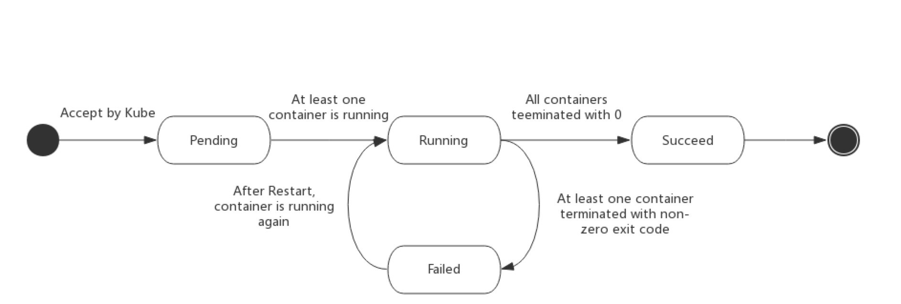

启动和关闭示意：

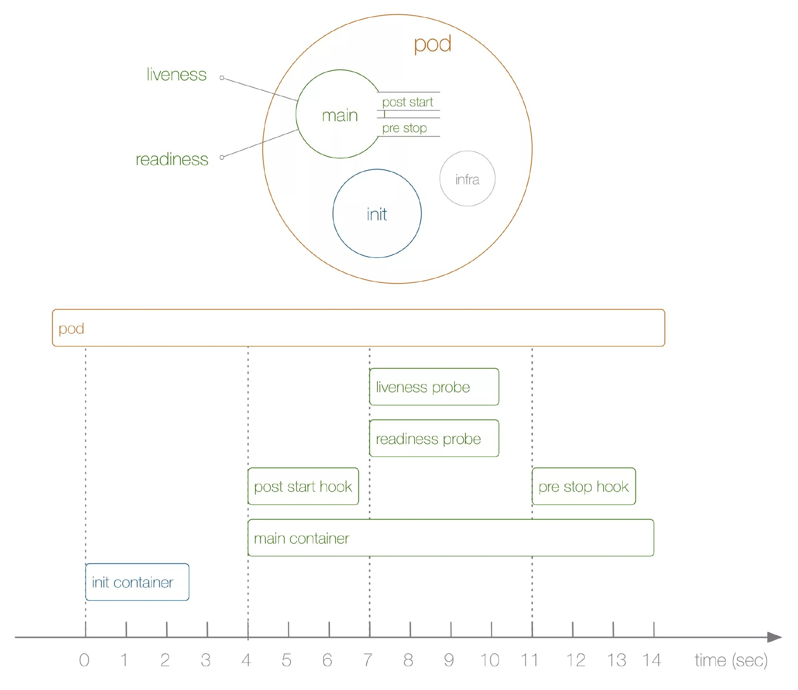

初始化容器，init container做什么：

- 验证业务应用依赖的组件是否均已启动
- 修改目录的权限
- 调整系统参数
- istio iptables规则设置

```yaml
...
      initContainers:
      - command:
        - /sbin/sysctl
        - -w
        - vm.max_map_count=262144
        image: alpine:3.6
        imagePullPolicy: IfNotPresent
        name: elasticsearch-logging-init
        resources: {}
        securityContext:
          privileged: true
      - name: fix-permissions
        image: alpine:3.6
        command: ["sh", "-c", "chown -R 1000:1000 /usr/share/elasticsearch/data"]
        securityContext:
          privileged: true
        volumeMounts:
        - name: elasticsearch-logging
          mountPath: /usr/share/elasticsearch/data
...

```


验证Pod生命周期：

```yaml
apiVersion: v1
kind: Pod
metadata:
  name: pod-lifecycle
  namespace: luffy
  labels:
    component: pod-lifecycless
spec:
  initContainers:
  - name: init
    image: busybox
    command: ['sh', '-c', 'echo $(date +%s): INIT >> /loap/timing']
    volumeMounts:
    - mountPath: /loap
      name: timing
  containers:
  - name: main
    image: busybox
    command: ['sh', '-c', 'echo $(date +%s): START >> /loap/timing;
sleep 10; echo $(date +%s): END >> /loap/timing;']
    volumeMounts:
    - mountPath: /loap 
      name: timing
    livenessProbe:
      exec:
        command: ['sh', '-c', 'echo $(date +%s): LIVENESS >> /loap/timing']
    readinessProbe:
      exec:
        command: ['sh', '-c', 'echo $(date +%s): READINESS >> /loap/timing']
    lifecycle:
      postStart:
        exec:
          command: ['sh', '-c', 'echo $(date +%s): POST-START >> /loap/timing']
      preStop:
        exec:
          command: ['sh', '-c', 'echo $(date +%s): PRE-STOP >> /loap/timing']
  volumes:
  - name: timing
    hostPath:
      path: /tmp/loap


```

创建pod测试：

```powershell
$ kubectl create -f pod-lifecycle.yaml

## 查看demo状态
$ kubectl -n luffy get po -o wide -w

## 查看调度节点的/tmp/loap/timing
$ cat /tmp/loap/timing
1585424708: INIT
1585424746: START
1585424746: POST-START
1585424754: READINESS
1585424756: LIVENESS
1585424756: END


```

>  须主动杀掉 Pod 才会触发 `pre-stop hook`，如果是 Pod 自己 Down 掉，则不会执行 `pre-stop hook` ,且杀掉Pod进程前，进程必须是正常运行状态，否则不会执行pre-stop钩子


###### 小结

知识点：

1. 实现k8s平台`与特定的容器运行时解耦`，提供更加灵活的业务部署方式，引入了Pod概念

2. k8s使用`yaml格式定义资源文件`，yaml中Map与List的语法，与json做类比

3. 通过kubectl apply| get | exec | logs | delete 等操作k8s资源，必须指定namespace

4. 每启动一个Pod，`为了实现网络空间共享，会先创建Infra容器`，并把其他容器网络加入该容器

5. 通过livenessProbe和readinessProbe实现Pod的`存活性`和`就绪健康检查`

6. 通过requests和limit分别限定`容器初始资源`申请与`最高上限`资源申请

7. Pod通过initContainer和lifecycle分别来执行初始化、pod启动和删除时候的操作，使得功能更加全面和灵活

8. 编写yaml讲究方法，学习k8s，养成从官方网站查询知识的习惯

   

做了哪些工作：

1. 定义Pod.yaml，将myblog和mysql打包在同一个Pod中，使用myblog使用localhost访问mysql

2. mysql数据持久化，为myblog业务应用添加了健康检查和资源限制

3. 将myblog与mysql拆分，使用独立的Pod管理

4. yaml文件中的环境变量存在账号密码明文等敏感信息，使用**configMap和Secret来统一配置**，优化部署

   

只使用Pod, 面临的问题:

1. 业务应用启动多个副本
2. Pod重建后IP会变化，外部如何访问Pod服务
3. 运行业务Pod的某个节点挂了，可以自动帮我把Pod转移到集群中的可用节点启动起来
4. 我的业务应用功能是收集节点监控数据,需要把Pod运行在k8集群的各个节点上（agent）

> 为了解决上述问题，引入了workload工作负载


##### Pod控制器 ，多个pod

###### Workload (工作负载)

控制器又称工作负载是用于实现`管理pod的中间层，确保pod资源符合预期的状态`，pod的资源出现故障时，会尝试 进行重启，当根据重启策略无效，则会重新新建pod的资源。 

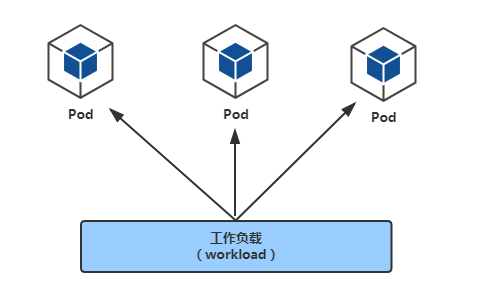

- ReplicaSet: 用户创建指定数量的pod副本数量，确保pod副本数量符合预期状态，并且支持滚动式自动扩容和缩容功能
- `Deployment`：工作在ReplicaSet之上，用于管理无状态应用，**目前来说最好的控制器**。支持滚动更新和回滚功能，提供声明式配置
- DaemonSet：用于确保集群中的每一个节点只运行特定的pod副本，通常用于实现系统级后台任务。比如EFK服务, (agent)
- Job：只要完成就立即退出，不需要重启或重建
- Cronjob：周期性任务控制，不需要持续后台运行
- StatefulSet：管理有状态应用


###### Deployment

`myblog/deployment/deploy-mysql.yaml`

```yaml
apiVersion: apps/v1
kind: Deployment
metadata:
  name: mysql
  namespace: luffy
spec:
  replicas: 1	#指定Pod副本数
  selector:		#指定Pod的选择器
    matchLabels:
      app: mysql
  template:
    metadata:
      labels:	#给Pod打label
        app: mysql
    spec:
      hostNetwork: true
      volumes: 
      - name: mysql-data
        hostPath: 
          path: /opt/mysql/data
      nodeSelector:   # 使用节点选择器将Pod调度到指定label的节点
        component: mysql
      containers:
      - name: mysql
        image: mysql:5.7
        args:
        - --character-set-server=utf8mb4
        - --collation-server=utf8mb4_unicode_ci
        ports:
        - containerPort: 3306
        env:
        - name: MYSQL_USER
          valueFrom:
            secretKeyRef:
              name: myblog
              key: MYSQL_USER
        - name: MYSQL_ROOT_PASSWORD
          valueFrom:
            secretKeyRef:
              name: myblog
              key: MYSQL_PASSWD
        - name: MYSQL_DATABASE
          value: "myblog"
        resources:
          requests:
            memory: 100Mi
            cpu: 50m
          limits:
            memory: 500Mi
            cpu: 100m
        readinessProbe:
          tcpSocket:
            port: 3306
          initialDelaySeconds: 5
          periodSeconds: 10
        livenessProbe:
          tcpSocket:
            port: 3306
          initialDelaySeconds: 15
          periodSeconds: 20
        volumeMounts:
        - name: mysql-data
          mountPath: /var/lib/mysql

```

`deploy-myblog.yaml`

```yaml
apiVersion: apps/v1
kind: Deployment
metadata:
  name: myblog
  namespace: luffy
spec:
  replicas: 2	#指定Pod副本数
  selector:		#指定Pod的选择器
    matchLabels:
      app: myblog
  template:
    metadata:
      labels:	#给Pod打label
        app: myblog
    spec:
      containers:
      - name: myblog
        image: 192.168.150.128:5000/myblog:v1
        imagePullPolicy: IfNotPresent
        env:
        - name: MYSQL_HOST
          valueFrom:
            configMapKeyRef:
              name: myblog
              key: MYSQL_HOST
        - name: MYSQL_PORT
          valueFrom:
            configMapKeyRef:
              name: myblog
              key: MYSQL_PORT
        - name: MYSQL_USER
          valueFrom:
            secretKeyRef:
              name: myblog
              key: MYSQL_USER
        - name: MYSQL_PASSWD
          valueFrom:
            secretKeyRef:
              name: myblog
              key: MYSQL_PASSWD
        ports:
        - containerPort: 8002
        resources:
          requests:
            memory: 100Mi
            cpu: 50m
          limits:
            memory: 500Mi
            cpu: 100m
        livenessProbe:
          httpGet:
            path: /blog/index/
            port: 8002
            scheme: HTTP
          initialDelaySeconds: 10  # 容器启动后第一次执行探测是需要等待多少秒
          periodSeconds: 15 	# 执行探测的频率
          timeoutSeconds: 2		# 探测超时时间
        readinessProbe: 
          httpGet: 
            path: /blog/index/
            port: 8002
            scheme: HTTP
          initialDelaySeconds: 10 
          timeoutSeconds: 2
          periodSeconds: 15

```


###### 创建Deployment

```powershell
$ kubectl create -f .
```

> controller-manger在etcd和scheduler中开始创建pod元数据，写入etcd


```python
# 元数据创建失败，比如，缺少serviceaccount 
# 如何排查
$ kubectl -n kube-system logs -f kube-controller-manager-k8s-master
I0706 01:11:02.064424       1 event.go:291] "Event occurred" object="luffy/mysql" kind="Deployment" apiVersion="apps/v1" type="Normal" reason="ScalingReplicaSet" message="Scaled up replica set mysql-7446f4dc7b to 1"
I0706 01:11:02.075178       1 event.go:291] "Event occurred" object="luffy/mysql-7446f4dc7b" kind="ReplicaSet" apiVersion="apps/v1" type="Normal" reason="SuccessfulCreate" message="Created pod: mysql-7446f4dc7b-6qzbv"
```


###### 生成数据中,CoreDns失败

查看配置的mysql环境变量、密码

```shell
[root@k8s-master deployment]# kubectl -n luffy describe configmaps 
[root@k8s-master deployment]# kubectl -n luffy describe secrets myblog
```

进入myblog容器，执行migrate，让mysql中有数据

```shell
[root@k8s-master deployment]# kubectl -n luffy exec -ti myblog-77c549d66c-7knng bash
[root@myblog-77c549d66c-7knng myblog]# python3 manage.py migrate
```

`ERROR` 两个pod只有1个正常

```
[root@k8s-master ~]# kubectl -n luffy get po -owide
NAME                      READY   STATUS    RESTARTS   AGE     IP                NODE         NOMINATED NODE   READINESS GATES
myblog-77c549d66c-5j2h2   1/1     Running   0          20m     10.240.1.29       k8s-slave1   <none>           <none>
myblog-77c549d66c-tqfn9   0/1     Running   1          2m30s   10.240.2.17       k8s-slave2   <none>           <none>
mysql-7446f4dc7b-lp942    1/1     Running   0          40m     192.168.150.129   k8s-slave1   <none>           <none>
```

1. 查看日志

   ```python
   # logs
   [root@k8s-master deployment]# kubectl -n luffy logs -f --tail=100 myblog-77c549d66c-ml4ww 
   [uWSGI] getting INI configuration from ./uwsgi.ini
   
   # 详情
   [root@k8s-master deployment]# kubectl -n luffy describe pod myblog-77c549d66c-ml4ww ^C
   
   Events:
     Type     Reason     Age                    From               Message
     ----     ------     ----                   ----               -------
     Normal   Scheduled  4m59s                  default-scheduler  Successfully assigned luffy/myblog-77c549d66c-ml4ww to k8s-slave2
     Normal   Created    3m46s (x2 over 4m58s)  kubelet            Created container myblog
     Normal   Started    3m46s (x2 over 4m58s)  kubelet            Started container myblog
     Warning  Unhealthy  3m1s (x6 over 4m46s)   kubelet            Liveness probe failed: Get "http://10.240.2.21:8002/blog/index/": context deadline exceeded (Client.Timeout exceeded while awaiting headers)
     Normal   Killing    3m1s (x2 over 4m16s)   kubelet            Container myblog failed liveness probe, will be restarted
     Warning  Unhealthy  2m45s (x8 over 4m45s)  kubelet            Readiness probe failed: Get "http://10.240.2.21:8002/blog/index/": context deadline exceeded (Client.Timeout exceeded while awaiting headers)
     Normal   Pulled     2m31s (x3 over 4m58s)  kubelet            Container image "192.168.150.128:5000/myblog:v1" already present on machine
     Warning  Unhealthy  2m31s (x2 over 3m46s)  kubelet            Readiness probe failed: Get "http://10.240.2.21:8002/blog/index/": EOF
   
   ```

2. 进入容器，curl数据库

   正常的容器

```python
[root@k8s-master ~]# kubectl -n luffy exec -ti myblog-77c549d66c-5j2h2 bash
[root@myblog-77c549d66c-5j2h2 myblog]# curl 192.168.150.129:3306
5.7.34iTdY{6ÿÿ󾃿󿿕+iM@>`Tn3+mysql_native_password!ÿ#08S01Got packets out of order[root@myblog-77c549d66c-5j2h2 myblog]# 
[root@myblog-77c549d66c-5j2h2 myblog]# 
[root@myblog-77c549d66c-5j2h2 myblog]# 
[root@myblog-77c549d66c-5j2h2 myblog]# exit
exit
```

not Ready的容器，与mysql无法通信

```python
[root@k8s-master deployment]# kubectl -n luffy exec -ti myblog-77c549d66c-k8t2j bash
kubectl exec [POD] [COMMAND] is DEPRECATED and will be removed in a future version. Use kubectl exec [POD] -- [COMMAND] instead.
[root@myblog-77c549d66c-k8t2j myblog]# 
[root@myblog-77c549d66c-k8t2j myblog]# curl 192.168.150.129:3306


^C
[root@myblog-77c549d66c-k8t2j myblog]# ping 192.168.150.128
PING 192.168.150.128 (192.168.150.128) 56(84) bytes of data.

^C

```

3. 启动5个副本，观察

   只有和mysql同node的pod才能访问到

   ```python
   [root@k8s-master deployment]# kubectl -n luffy scale deploy myblog --replicas=5
   deployment.apps/myblog scaled
   [root@k8s-master deployment]# 
   [root@k8s-master deployment]# kubectl -n luffy get pod -owide
   NAME                      READY   STATUS    RESTARTS   AGE     IP                NODE         NOMINATED NODE   READINESS GATES
   myblog-77c549d66c-4mxsb   1/1     Running   0          4m57s   10.240.1.30       k8s-slave1   <none>           <none>
   myblog-77c549d66c-4tlpz   0/1     Running   5          6m37s   10.240.2.23       k8s-slave2   <none>           <none>
   myblog-77c549d66c-clb9l   0/1     Running   5          6m37s   10.240.0.12       k8s-master   <none>           <none>
   myblog-77c549d66c-dtvn8   1/1     Running   0          3m56s   10.240.1.31       k8s-slave1   <none>           <none>
   myblog-77c549d66c-rcc6l   0/1     Running   3          4m7s    10.240.2.24       k8s-slave2   <none>           <none>
   mysql-7446f4dc7b-lp942    1/1     Running   0          78m     192.168.150.129   k8s-slave1   <none>           <none>
   
   ```

   4. 检查防火墙

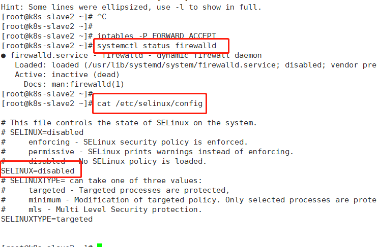

5. coreDns无法正常服务

   往下面走的时候，遇到CoreDNs无法提供正常服务，后续解决

   ```python
   [root@k8s-master week02]# kubectl -n kube-system get po -owide
   NAME                                 READY   STATUS             RESTARTS   AGE   IP                NODE         NOMINATED NODE   READINESS GATES
   coredns-6d56c8448f-ct886             0/1     Running            96         15d   10.240.0.11       k8s-master   <none>           <none>
   coredns-6d56c8448f-wbszj             0/1     CrashLoopBackOff   96         15d   10.240.0.10       k8s-master   <none>           <none>
   
   ```

   排查 ....  https://blog.csdn.net/u011663005/article/details/87937800

   排查失败，重装k8s

6. 老师给同学排查

   > 嗯 主要 就是 包括master的三台node节点  删除flannel 和cni    
   >
   > 就是用 ip  link  del  
   > 然后在master重启flannel  看下日志没问题就行

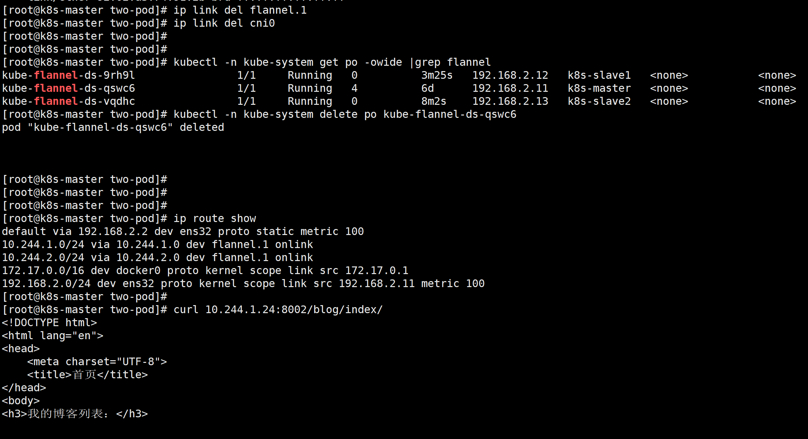

​	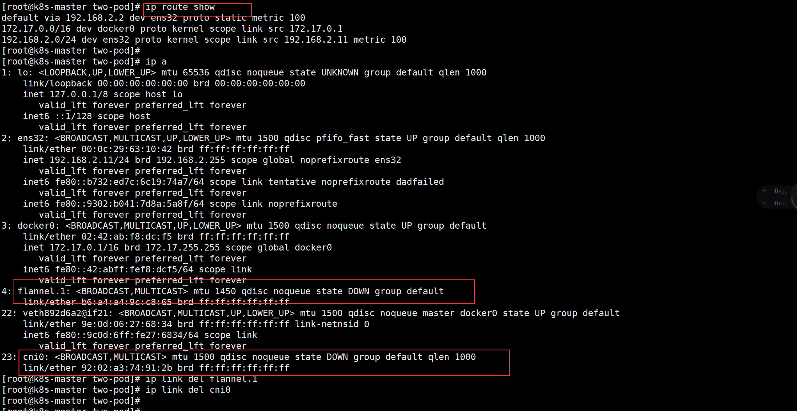


###### 查看Deployment

```powershell
# kubectl api-resources
$ kubectl -n luffy get deploy
NAME     READY   UP-TO-DATE   AVAILABLE   AGE
myblog   1/1     1            1           2m22s
mysql    1/1     1            1           2d11h

  * `NAME` 列出了集群中 Deployments 的名称。
  * `READY`显示当前正在运行的副本数/期望的副本数。
  * `UP-TO-DATE`显示已更新以实现期望状态的副本数。
  * `AVAILABLE`显示应用程序可供用户使用的副本数。
  * `AGE` 显示应用程序运行的时间量。

# 查看pod
$ kubectl -n luffy get po
NAME                      READY   STATUS    RESTARTS   AGE
myblog-7c96c9f76b-qbbg7   1/1     Running   0          109s
mysql-85f4f65f99-w6jkj    1/1     Running   0          2m28s

# 查看replicaSet
$ kubectl -n luffy get rs
$ kubectl -n luffy get replicasets.apps 
NAME                DESIRED   CURRENT   READY   AGE
myblog-77c549d66c   2         2         2       4m47s
mysql-7446f4dc7b    1         1         1       4m47s
```


###### 副本保障机制

controller实时检测pod状态，并保障副本数一直处于期望的值。

```powershell
# 观察pod
$ kubectl get pods -o wide -w

## 删除pod，观察pod状态变化,这边删除，control-manager立即创建
$ kubectl -n luffy delete pod myblog-7c96c9f76b-qbbg7
先把旧的状态置为Terminate
myblog-7c96c9f76b-qbbg7 pod  1/1 Terminating

同时创建新的
myblog-77c549d66c-c25lf   0/1     Pending 
myblog-77c549d66c-c25lf   0/1     ContainerCreating
myblog-77c549d66c-c25lf   1/1     Running

新的Runnging正常，删除旧的
myblog-77c549d66c-hwcpj   0/1     Terminating 

# 扩容
## 设置两个副本, 或者通过kubectl -n luffy edit deploy myblog的方式，最好通过修改文件，然后apply的方式，这样yaml文件可以保持同步
$ kubectl -n luffy scale deploy myblog --replicas=2

# 缩容
$ kubectl -n luffy scale deploy myblog --replicas=1

# ⭐️推荐edit命令,编辑最新yaml副本数，直接生效
kubectl -n luffy edit deployments.apps myblog

# 观察pod
$ kubectl get pods -o wide
NAME                      READY   STATUS    RESTARTS   AGE
myblog-7c96c9f76b-qbbg7   1/1     Running   0          11m
myblog-7c96c9f76b-s6brm   1/1     Running   0          55s
mysql-85f4f65f99-w6jkj    1/1     Running   0          11m


# 观察replicaSet
$ kubectl -n luffy get ReplicaSet
[root@k8s-master demployment]# kubectl -n luffy get rs
NAME                DESIRED   CURRENT   READY   AGE
myblog-77c549d66c   3         3         2       11m
mysql-7446f4dc7b    1         1         1       11m
# NAME是77c549d66c根据deployment.yaml {image,..} 编码生成的 

```

###### Pod驱逐策略

K8S 有个特色功能叫 pod eviction，它在某些场景下如`节点 NotReady`，或者`节点资源不足时`，`把 pod 驱逐至其它节点`，这也是出于业务保护的角度去考虑的。

```python
# 当挂载的docker的磁盘Use%超过80%
[root@k8s-slave1 ~]# df -Th
Filesystem              Type      Size  Used Avail Use% Mounted on
/var/lib/docker/overlay2/13983c53c1eef8a9
shm                     tmpfs      64M     0   64M   40% /var/lib/docker/containers/eea40e626/shm
shm                     tmpfs      64M     0   64M   80% 

# kubelet
# 清理本地image，全部干干净
# 去驱逐pod到其他节点
```


1. Kube-controller-manager: 周期性检查所有节点状态，当节点处于 NotReady 状态超过一段时间后，驱逐该节点上所有 pod。

   - `pod-eviction-timeout`

     > NotReady 状态节点超过该时间后，执行驱逐，默认 5 min，适用于k8s 1.13版本之前

   - 1.13版本后，集群开启` TaintBasedEvictions 与TaintNodesByCondition` 功能，即[taint-based-evictions](https://kubernetes.io/docs/concepts/scheduling-eviction/taint-and-toleration/)，

     > 节点若失联或者出现各种异常情况，k8s会自动`为node打上污点`，同时`为pod默认添加如下，容忍设置`：
     
     ```yaml
      [root@k8s-master ~]# kubectl -n luffy get po myblog-77c549d66c-r4gks -oyaml
      ... 
      tolerations:
       - effect: NoExecute
         key: node.kubernetes.io/not-ready
         operator: Exists
         tolerationSeconds: 300
       - effect: NoExecute
         key: node.kubernetes.io/unreachable
         operator: Exists
         tolerationSeconds: 300
     ...
     ```
     
     即各pod可以独立设置驱逐容忍时间。

2. Kubelet: 周期性检查本节点资源，当资源不足时，按照优先级驱逐部分 pod
   - `memory.available`：节点可用内存
   - `nodefs.available`：节点根盘可用存储空间
   - `nodefs.inodesFree`：节点inodes可用数量
   - `imagefs.available`：镜像存储盘的可用空间
   - `imagefs.inodesFree`：镜像存储盘的inodes可用数量


###### 服务更新

修改服务，重新打tag模拟服务更新。

更新方式：

1. 修改yaml文件，使用`kubectl -n luffy apply -f deploy-myblog.yaml`来应用更新

2. `kubectl -n luffy edit deploy myblog`在线更新

3. `kubectl -n luffy set image deploy myblog myblog=172.21.51.143:5000/myblog:v2 --record` 

修改文件测试：

```powershell
$ vi /home/redhat/week01/python-demo/blog/template/index.html
$ docker build . -t 172.21.51.143:5000/myblog:v2 -f Dockerfile
$ dokcer images
$ docker push 172.21.51.143:5000/myblog:v2

# 执行三种更新方式
# 1、修改yaml
# kubectl -n luffy edit deployments.apps myblog
        image: 192.168.150.128:5000/myblog:v2  # 修改v1为v2
        
# kubectl -n luffy  get po -owide
  观察pod，生成2个新的，删除2个旧的
```


###### 更新策略

1、滚动更新策略

deploy的yaml

```yaml
# kubectl -n luffy get deployments.apps -oyaml
...
spec:
  replicas: 2	#指定Pod副本数
  selector:		#指定Pod的选择器
    matchLabels:
      app: myblog
  strategy:
    rollingUpdate:
      maxSurge: 25%  # 更新过程中，最多允许3个pod出现
      maxUnavailable: 25%  # 最多不可用pod为2-0=2个
    type: RollingUpdate		#指定更新方式为滚动更新，默认策略，通过get deploy yaml查看
    ...
```

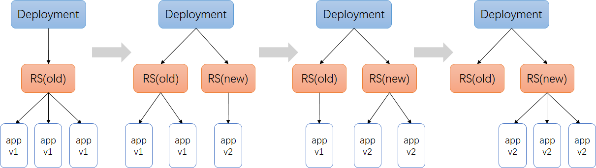

策略控制：

- maxSurge：最大激增数, 指更新过程中, `最多可以比replicas预先设定值多出的pod数量`, 可以为固定值或百分比,默认为desired Pods数的25%。计算时向上取整(比如3.4，取4)，更新过程中最多会有replicas + maxSurge个pod
- maxUnavailable： 指更新过程中, `最多有几个pod处于无法服务状态` , 可以为固定值或百分比，默认为desired Pods数的25%。计算时向下取整(比如3.6，取3)

> *在Deployment rollout时，需要保证Available(Ready) Pods数不低于 desired pods number - maxUnavailable; 保证所有的非异常状态Pods数不多于 desired pods number + maxSurge*。 `2< pod_number<3`

以myblog为例，使用默认的策略，更新过程:

1. maxSurge 25%，2个实例，向上取整，则maxSurge为1，意味着最多可以有2+1=3个Pod，那么此时会新创建1个ReplicaSet，RS-new，把副本数置为1，此时呢，副本控制器就去创建这个新的Pod
2. 同时，maxUnavailable是25%，副本数2*25%，向下取整，则为0，意味着，滚动更新的过程中，不能有少于2个可用的Pod，因此，旧的Replica（RS-old）会先保持不动，等RS-new管理的Pod状态Ready后，此时已经有3个Ready状态的Pod了，那么由于只要保证有2个可用的Pod即可，因此，RS-old的副本数会有2个变成1个，此时，会删掉一个旧的Pod
3. 删掉旧的Pod的时候，由于总的Pod数量又变成2个了，因此，距离最大的3个还有1个Pod可以创建，所以，RS-new把管理的副本数由1改成2，此时又会创建1个新的Pod，等RS-new管理了2个Pod都ready后，那么就可以把RS-old的副本数由1置为0了，这样就完成了滚动更新

```powershell
#查看滚动更新事件
$ kubectl -n luffy describe deploy myblog
...
Events:
  Type    Reason             Age   From                   Message
  ----    ------             ----  ----                   -------
  Normal  ScalingReplicaSet  11s   deployment-controller  Scaled up replica set myblog-6cf56fc848 to 1
  Normal  ScalingReplicaSet  11s   deployment-controller  Scaled down replica set myblog-6fdcf98f9 to 1
  Normal  ScalingReplicaSet  11s   deployment-controller  Scaled up replica set myblog-6cf56fc848 to 2
  Normal  ScalingReplicaSet  6s    deployment-controller  Scaled down replica set myblog-6fdcf98f9 to 0

#查看rs
$ kubectl get rs
NAME                     DESIRED   CURRENT   READY   AGE
myblog-6cf56fc848   2         2         2       16h
myblog-6fdcf98f9    0         0         0       16h


```


2、Recreate更新策略

除了滚动更新以外，还有一种策略是Recreate，直接`在当前的pod基础上先删后建`：

```powershell
...
  strategy:
    type: Recreate
...
```


我们课程中的mysql服务应该使用Recreate来管理：

对于mysql需要用Recreate更新。如果用滚动更新，会出现2个mysql的pod要同时挂载到同1个目录。启动失败

```powershell
$ kubectl -n luffy edit deploy mysql
...
  selector:
    matchLabels:
      app: mysql
  strategy:
    type: Recreate
  template:
    metadata:
      creationTimestamp: null
      labels:
        app: mysql
...
```


###### 服务回滚（不常用）

通过滚动升级的策略可以平滑的升级Deployment，若升级出现问题，需要最快且最好的方式回退到上一次能够提供正常工作的版本。为此K8S提供了回滚机制。

**revision**：更新应用时，K8S都会记录当前的版本号，即为revision，当升级出现问题时，可通过回滚到某个特定的revision，默认配置下，K8S只会保留最近的几个revision，可以通过Deployment配置文件中的spec.revisionHistoryLimit属性增加revision数量，默认是10。

查看当前：

```powershell
$ kubectl -n luffy rollout history deploy myblog ##CHANGE-CAUSE为空
$ kubectl delete -f deploy-myblog.yaml    ## 方便演示到具体效果，删掉已有deployment

```

记录回滚：

```powershell
$ kubectl apply -f deploy-myblog.yaml --record

$ kubectl -n luffy edit deployment.apps myblog --record
# 修改为v2

$ kubectl -n luffy set image deploy myblog myblog=172.21.51.143:5000/myblog:v2 --record=true


```

查看deployment更新历史：

```powershell
$ kubectl -n luffy rollout history deploy myblog
deployment.extensions/myblog
REVISION  CHANGE-CAUSE
1         kubectl create --filename=deploy-myblog.yaml --record=true
2         kubectl set image deploy myblog myblog=172.21.51.143:5000/demo/myblog:v1 --record=true


```

回滚到具体的REVISION:

```powershell
# 回滚到某个record
$ kubectl -n luffy rollout undo deploy myblog --to-revision=1
deployment.extensions/myblog rolled back

# 访问应用测试
```


##### Kubernetes服务访问之Service(重点)：四层负载均衡

通过以前的学习，我们已经能够通过Deployment来创建一组Pod来提供具有高可用性的服务。虽然每个Pod都会分配一个单独的Pod IP，然而却存在如下两个问题：

- Pod IP仅仅是集群内可见的**虚拟IP，外部无法访问**。
- Pod IP会随着Pod的销毁而消失，当ReplicaSet对Pod进行动态伸缩时，**Pod IP可能随时随地都会变化**，这样对于我们访问这个服务带来了难度。

###### Service 负载均衡之Cluster IP

service是一组pod的服务抽象，相当于`一组pod的LB`，负责将请求分发给对应的pod。service会为这个LB提供一个IP，一般称为`cluster IP `。使用Service对象，通过`selector进行标签选择`，找到对应的Pod:

查看lable

```shell
[root@k8s-master deployment]# kubectl -n luffy get po --show-labels
NAME                      READY   STATUS    RESTARTS   AGE   LABELS
myblog-77c549d66c-4mxsb   1/1     Running   0          11m   app=myblog,pod-template-hash=77c549d66c
myblog-77c549d66c-dtvn8   1/1     Running   0          10m   app=myblog,pod-template-hash=77c549d66c
mysql-7446f4dc7b-lp942    1/1     Running   0          84m   app=mysql,pod-template-hash=7446f4dc7b
[root@k8s-master deployment]# kubectl -n luffy get po -l app=myblog
NAME                      READY   STATUS    RESTARTS   AGE
myblog-77c549d66c-4mxsb   1/1     Running   0          11m
myblog-77c549d66c-dtvn8   1/1     Running   0          10m
```


`myblog/deployment/svc-myblog.yaml`

```yaml
apiVersion: v1
kind: Service
metadata:
  name: myblog
  namespace: luffy
spec:
  ports:
  - port: 80
    protocol: TCP
    targetPort: 8002 
  selector:
    app: myblog
  type: ClusterIP 
```


操作演示：

```powershell
## 别名
$ alias kd='kubectl -n luffy'

## 创建服务
$ kd create -f svc-myblog.yaml

# 查看service
$ kd get svc
NAME     TYPE        CLUSTER-IP     EXTERNAL-IP   PORT(S)   AGE
myblog   ClusterIP   10.99.174.93   <none>        80/TCP    7m50s

# 以label查看pod
$ kd get po --show-labels
NAME                      READY   STATUS    RESTARTS   AGE    LABELS
myblog-5c97d79cdb-jn7km   1/1     Running   0          6m5s   app=myblog
mysql-85f4f65f99-w6jkj    1/1     Running   0          176m   app=mysql


# 查看slb service
$ kd describe svc myblog
Name:              myblog
Namespace:         demo
Labels:            <none>
Annotations:       <none>
Selector:          app=myblog
Type:              ClusterIP
IP:                10.99.174.93
Port:              <unset>  80/TCP
TargetPort:        8002/TCP
Endpoints:         10.244.0.68:8002
Session Affinity:  None
Events:            <none>

## 扩容myblog服务
$ kd scale deploy myblog --replicas=2
deployment.extensions/myblog scaled

## 再次查看
$ kd describe svc myblog
Name:              myblog
Namespace:         demo
Labels:            <none>
Annotations:       <none>
Selector:          app=myblog
Type:              ClusterIP
IP:                10.99.174.93
Port:              <unset>  80/TCP
TargetPort:        8002/TCP
Endpoints:         10.244.0.68:8002,10.244.1.158:8002
Session Affinity:  None
Events:            <none>

# 访问
[root@k8s-master week02]# curl 10.98.231.16:80
```

Service与Pod如何关联:

service对象创建的同时，会`创建同名的endpoints对象`，若服务设置了readinessProbe, 当`readinessProbe检测`失败时，endpoints列表中会剔除掉对应的pod_ip，这样流量就不会分发到健康检测失败的Pod中

```powershell
$ kd get endpoints myblog
NAME     ENDPOINTS                            AGE
myblog   10.244.0.68:8002,10.244.1.158:8002   7m


```

Service Cluster-IP如何访问:

```powershell
$ kd get svc myblog
NAME   TYPE        CLUSTER-IP       EXTERNAL-IP   PORT(S)   AGE
myblog   ClusterIP   10.99.174.93   <none>        80/TCP    13m

[root@k8s-master ~]# kubectl -n luffy describe svc myblog 
Name:              myblog
Namespace:         luffy
Labels:            <none>
Annotations:       <none>
Selector:          app=myblog
Type:              ClusterIP
IP:                10.98.231.16
Port:              <unset>  80/TCP
TargetPort:        8002/TCP
Endpoints:         10.240.1.32:8002,10.240.1.33:8002

$ curl 10.99.174.93/blog/index/


```

为外部应用创建servcie，模拟service的yaml，替换自己的ip

```
[root@k8s-master ~]# kubectl -n luffy get endpoints -oyaml
```


为mysql服务创建service：


```yaml
[root@k8s-master week02]# vim svc-mysql.yaml
apiVersion: v1
kind: Service
metadata:
  name: mysql
  namespace: luffy
spec:
  ports:
  - port: 3306
    protocol: TCP
    targetPort: 3306
  selector:
    app: mysql
  type: ClusterIP

[root@k8s-master week02]# kubectl apply -f svc-mysql.yaml
```


访问mysql：

```powershell
[root@k8s-master week02]# kubectl -n luffy get service

$ kd get svc mysql
mysql    ClusterIP   10.108.214.84   <none>        3306/TCP   3s

[root@k8s-master week02]# kubectl -n luffy get endpoints

[root@k8s-master week02]# kubectl -n luffy get po -owide


$ curl 10.108.214.84:3306
```

目前使用hostNetwork部署，通过宿主机ip+port访问，弊端：

- 服务使用hostNetwork，使得宿主机的端口大量暴漏，存在安全隐患
- 容易引发端口冲突

服务均属于k8s集群，尽可能使用k8s的网络访问，因此可以对目前myblog访问mysql的方式做改造：

- 为mysql创建一个固定clusterIp的Service，把clusterIp配置在myblog的环境变量中
- 利用集群服务发现的能力，组件之间通过service name来访问


###### 服务发现

在k8s集群中，组件之间可以`通过定义的Service名称实现通信`。

演示服务发现：

```powershell
## 演示思路：在myblog的容器中直接通过service名称访问服务，观察是否可以访问通

# 先查看服务
$ kd get svc
NAME     TYPE        CLUSTER-IP      EXTERNAL-IP   PORT(S)    AGE
myblog   ClusterIP   10.99.174.93    <none>        80/TCP     59m
mysql    ClusterIP   10.108.214.84   <none>        3306/TCP   35m

# 进入myblog容器
$ kd exec -ti myblog-5c97d79cdb-j485f -c myblog -- bash

$ env |grep -i mysql
MYSQL_SERVICE_PORT=3306
MYSQL_HOST=10.240.1.5
MYSQL_USER=root
MYSQL_PORT=3306
MYSQL_SERVICE_HOST=10.111.241.25
MYSQL_PASSWD=123456

[root@k8s-master week02]# curl 10.109.239.70:3306
5.7.34тj({7l\ÿÿ󾃿󿿕}=~;-~%j0]|mysql_native_password!ÿ#08S01Got

[root@myblog-5c97d79cdb-j485f myblog]# curl mysql:3306
5.7.29 )→  (mysql_native_password ot packets out of order

[root@myblog-5c97d79cdb-j485f myblog]# curl myblog/blog/index/
<!DOCTYPE html>
<html lang="en">
<head>
    <meta charset="UTF-8">
    <title>首页</title>
</head>
<body>
<h3>我的博客列表：</h3>
```

虽然podip和clusterip都不固定，但是`service name是固定的，而且具有完全的跨集群可移植性`，因此组件之间调用的同时，完全可以通过service name去通信，这样避免了大量的ip维护成本，使得服务的yaml模板更加简单。因此可以对mysql和myblog的部署进行优化改造：

1. mysql可以去掉hostNetwork部署，使得服务只暴漏在k8s集群内部网络
2. configMap中数据库地址可以换成Service名称，这样跨环境的时候，配置内容基本上可以保持不用变化

修改deploy-mysql.yaml

```yaml
    spec:
      hostNetwork: true	# 去掉此行
      volumes: 
      - name: mysql-data
        hostPath: 
          path: /opt/mysql/data


        ports:
        - containerPort: 3306
          hostPort: 3306 	# 去掉此行
          protocol: TCP
```

修改configmap.yaml

```yaml
[root@k8s-master deployment]# kubectl -n luffy edit configmaps  myblog
apiVersion: v1
kind: ConfigMap
metadata:
  name: myblog
  namespace: luffy
data:
  MYSQL_HOST: "mysql"	# 此处替换为mysql
  MYSQL_PORT: "3306"


```

应用修改：

```powershell
$ kubectl delete -f deployment-mysql.yaml

## myblog不用动，会自动因健康检测不过而重启
```

服务发现实现：

 `CoreDNS`是一个`Go`语言实现的链式插件`DNS服务端`，是CNCF成员，是一个高性能、易扩展的`DNS服务端`。 

```powershell
$ kubectl -n kube-system get po -o wide|grep dns
coredns-d4475785-2w4hk             1/1     Running   0          4d22h   10.244.0.64       
coredns-d4475785-s49hq             1/1     Running   0          4d22h   10.244.0.65

# 查看myblog的pod,的dns解析配置
$ kubectl -n luffy exec -ti myblog-5c97d79cdb-j485f bash

[root@myblog-5c97d79cdb-j485f myblog]# cat /etc/resolv.conf
nameserver 10.96.0.10
search luffy.svc.cluster.local svc.cluster.local cluster.local
options ndots:5

## 10.96.0.10 从哪来，k8s的dns
$ kubectl -n kube-system get svc
NAME       TYPE        CLUSTER-IP   EXTERNAL-IP   PORT(S)         AGE
kube-dns   ClusterIP   10.96.0.10   <none>        53/UDP,53/TCP   51d

## 启动pod的时候，会把kube-dns服务的cluster-ip地址注入到pod的resolve解析配置中，同时添加对应的namespace的search域。 因此跨namespace通过service name访问的话，需要添加对应的namespace名称，
service_name.namespace

$ kubectl get svc
NAME         TYPE        CLUSTER-IP   EXTERNAL-IP   PORT(S)   AGE
kubernetes   ClusterIP   10.96.0.1    <none>        443/TCP   26h


```


###### Service负载均衡之NodePort（生产不推荐）

cluster-ip为虚拟地址，只能在k8s集群内部进行访问，`集群外部如果访问内部服务`，实现方式之一为使用NodePort方式。NodePort会默认在 30000-32767 ，不指定的会随机使用其中一个。

`myblog/deployment/svc-myblog-nodeport.yaml`

```powershell
apiVersion: v1
kind: Service
metadata:
  name: myblog-np # name
  namespace: luffy
spec:
  ports:
  - port: 80
    protocol: TCP
    targetPort: 8002
  selector:
    app: myblog
  type: NodePort   #NodePort


```

查看并访问服务：

```powershell
$ kd create -f svc-myblog-nodeport.yaml
service/myblog-np created
$ kd get svc
NAME        TYPE        CLUSTER-IP       EXTERNAL-IP   PORT(S)        AGE
myblog      ClusterIP   10.99.174.93     <none>        80/TCP         102m
myblog-np   NodePort    10.105.228.101   <none>        80:30647/TCP   4s
mysql       ClusterIP   10.108.214.84    <none>        3306/TCP       77m

#集群内每个节点的NodePort端口都会进行监听
$ curl 172.21.51.143:30647/blog/index/
我的博客列表

## 浏览器访问


```

思考：

1. NodePort的端口监听如何转发到对应的Pod服务？

2. CLUSTER-IP为虚拟IP，集群内如何通过虚拟IP访问到具体的Pod服务？

###### kube-proxy（重点）

```python
# 面试题： 
k8s的Service Cluster-IP能不能ping通，但是可以curl通
```


检验

```shell
[root@k8s-master deployment]# kubectl -n luffy get service
NAME        TYPE        CLUSTER-IP      EXTERNAL-IP   PORT(S)        AGE
myblog      ClusterIP   10.109.90.226   <none>        80/TCP         37m
myblog-np   NodePort    10.99.106.109   <none>        80:31545/TCP   15s
mysql       ClusterIP   10.111.241.25   <none>        3306/TCP       35m

[root@k8s-master deployment]# ping 10.111.241.25
PING 10.111.241.25 (10.111.241.25) 56(84) bytes of data.
^C
--- 10.111.241.25 ping statistics ---
3 packets transmitted, 0 received, 100% packet loss, time 1999ms

# 在任何一个节点都可以curl
[root@k8s-master deployment]# curl 10.111.241.25:3306
5.7.34򁅑(PwQ	Wÿÿ󾃿󿿕F 
\7HkFfmysql_native_password!ÿ#08S01Got packets out of order[root@k8s-master deployment]#

[root@k8s-slave1 ~]# curl 10.111.241.25:3306
5.7.3448*p
          %lv#ÿÿ󾃿󿿕_K).A&(3[ymysql_native_password!ÿ#08S01Got packets out of order[root@k8s-slave1 ~]#
```


 运行在每个节点上，监听 API Server 中服务对象的变化，再通过创建流量路由规则来实现网络的转发。[参照]( https://kubernetes.io/docs/concepts/services-networking/service/#virtual-ips-and-service-proxies)

有三种模式：

- User space, 让 Kube-Proxy 在用户空间监听一个端口，所有的 Service 都转发到这个端口，然后 Kube-Proxy 在内部应用层对其进行转发 ， 所有报文都走一遍用户态，性能不高，k8s v1.2版本后废弃。
- `Iptables， 当前默认模式`，完全由 IPtables 来实现， 通过各个node节点上的iptables规则来`实现service的负载均衡`，但是随着service数量的增大，iptables模式由于线性查找匹配、全量更新等特点，其`性能会显著下降`。 
- `IPVS`， 与iptables同样基于Netfilter，但是`采用的hash表`，因此当service数量达到一定规模时，hash查表的速度优势就会显现出来，从而提高service的服务性能。 k8s 1.8版本开始引入，1.11版本开始稳定，需要开启宿主机的ipvs模块。

 IPtables模式示意图：

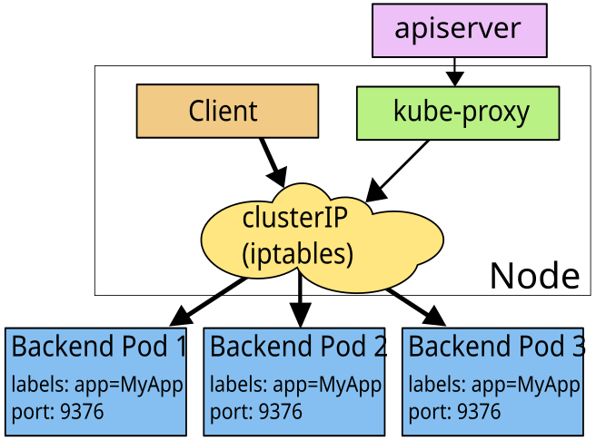

原理kube-proxy监听api-server，从etcd取出对应关系，然后转发到pod

```js
[root@k8s-master ~]# kubectl -n luffy describe svc mysql 
Name:              mysql
Namespace:         luffy
Labels:            <none>
Annotations:       <none>
Selector:          app=mysql
Type:              ClusterIP
IP:                10.111.241.25
Port:              <unset>  3306/TCP
TargetPort:        3306/TCP
Endpoints:         10.240.1.10:3306
Session Affinity:  None
Events:            <none>
```

```shell
[root@k8s-master deployment]# kubectl -n kube-system get pod -owide
NAME                                 READY   STATUS    RESTARTS   AGE    IP                NODE         NOMINATED NODE   READINESS 
kube-proxy-44q22                     1/1     Running   0          118m   192.168.150.130   k8s-slave2   <none>           <none>
kube-proxy-92dwl                     1/1     Running   0          118m   192.168.150.129   k8s-slave1   <none>           <none>
kube-proxy-9jcz4                     1/1     Running   0          118m   192.168.150.128   k8s-master   <none>           <none>
kube-scheduler-k8s-master            1/1     Running   0          118m   192.168.150.128   k8s-master 

# 使用iptables
[root@k8s-master deployment]# kubectl -n kube-system logs -f kube-proxy-44q22 
... 
I0717 02:58:19.892945       1 server_others.go:186] Using iptables Proxier.

```


正在使用iptables模式

Nat地址转换协议

```shell
# iptable的连接链
# clusterIp ---> 原地址ip

# culsterIp可以访问
[root@k8s-slave1 ~]# curl 10.111.241.25:3306
5.7.3448*p
          %lv#ÿÿ󾃿󿿕_K).A&(3[ymysql_native_password!ÿ#08S01Got packets out of order

# 查看clusterIp的iptables
[root@k8s-master deployment]# iptables-save |grep "10.111.241.25"
-A KUBE-SERVICES ! -s 10.240.0.0/12 -d 10.111.241.25/32 -p tcp -m comment --comment "luffy/mysql cluster IP" -m tcp --dport 3306 -j KUBE-MARK-MASQ
-A KUBE-SERVICES -d 10.111.241.25/32 -p tcp -m comment --comment "luffy/mysql cluster IP" -m tcp --dport 3306 -j KUBE-SVC-K2PCVBVSUUMCX4HC

[root@k8s-master deployment]# iptables-save |grep KUBE-SVC-K2PCVBVSUUMCX4HC
:KUBE-SVC-K2PCVBVSUUMCX4HC - [0:0]
-A KUBE-SERVICES -d 10.111.241.25/32 -p tcp -m comment --comment "luffy/mysql cluster IP" -m tcp --dport 3306 -j KUBE-SVC-K2PCVBVSUUMCX4HC
-A KUBE-SVC-K2PCVBVSUUMCX4HC -m comment --comment "luffy/mysql" -j KUBE-SEP-JULK4NJY5HW3AA4G

[root@k8s-master deployment]# iptables-save |grep KUBE-SEP-JULK4NJY5HW3AA4G
:KUBE-SEP-JULK4NJY5HW3AA4G - [0:0]
-A KUBE-SEP-JULK4NJY5HW3AA4G -s 10.240.1.10/32 -m comment --comment "luffy/mysql" -j KUBE-MARK-MASQ
-A KUBE-SEP-JULK4NJY5HW3AA4G -p tcp -m comment --comment "luffy/mysql" -m tcp -j DNAT --to-destination 10.240.1.10:3306
-A KUBE-SVC-K2PCVBVSUUMCX4HC -m comment --comment "luffy/mysql" -j KUBE-SEP-JULK4NJY5HW3AA4G

# 原地址10.240.1.10
[root@k8s-master deployment]# curl 10.240.1.10:3306
5.7.34¯.w4~*#ÿÿ󾃿󿿕n9[,?hJmysql_native_password!ÿ#08S01Got packets out of order[root@k8s-master deployment]# XshellXshell
-bash: XshellXshell: command not found

```


```powershell
$ iptables-save |grep -v myblog-np|grep  "luffy/myblog"
-A KUBE-SERVICES ! -s 10.244.0.0/16 -d 10.99.174.93/32 -p tcp -m comment --comment "demo/myblog: cluster IP" -m tcp --dport 80 -j KUBE-MARK-MASQ
-A KUBE-SERVICES -d 10.99.174.93/32 -p tcp -m comment --comment "demo/myblog: cluster IP" -m tcp --dport 80 -j KUBE-SVC-WQNGJ7YFZKCTKPZK

$ iptables-save |grep KUBE-SVC-WQNGJ7YFZKCTKPZK
-A KUBE-SVC-WQNGJ7YFZKCTKPZK -m statistic --mode random --probability 0.50000000000 -j KUBE-SEP-GB5GNOM5CZH7ICXZ
-A KUBE-SVC-WQNGJ7YFZKCTKPZK -j KUBE-SEP-7GWC3FN2JI5KLE47

$  iptables-save |grep KUBE-SEP-GB5GNOM5CZH7ICXZ
-A KUBE-SEP-GB5GNOM5CZH7ICXZ -p tcp -m tcp -j DNAT --to-destination 10.244.1.158:8002

$ iptables-save |grep KUBE-SEP-7GWC3FN2JI5KLE47
-A KUBE-SEP-7GWC3FN2JI5KLE47 -p tcp -m tcp -j DNAT --to-destination 10.244.1.159:8002


```

> `面试题： k8s的Service Cluster-IP能不能ping通`

iptables模式下是不通的

> ping是需要网卡的，是icmp协议，没有人处理该协议
>
> clusterIp只是个ip地址，clusterIp和原地址是通过iptables的NAT转换的，iptables都是tcp协议的


**iptables转换ipvs模式**

```powershell
# 内核开启ipvs模块，集群各节点都执行
cat > /etc/sysconfig/modules/ipvs.modules <<EOF
#!/bin/bash
ipvs_modules="ip_vs ip_vs_lc ip_vs_wlc ip_vs_rr ip_vs_wrr ip_vs_lblc ip_vs_lblcr ip_vs_dh ip_vs_sh ip_vs_nq ip_vs_sed ip_vs_ftp nf_conntrack_ipv4"
for kernel_module in \${ipvs_modules}; do
    /sbin/modinfo -F filename \${kernel_module} > /dev/null 2>&1
    if [ $? -eq 0 ]; then
        /sbin/modprobe \${kernel_module}
    fi
done
EOF
chmod 755 /etc/sysconfig/modules/ipvs.modules && bash /etc/sysconfig/modules/ipvs.modules && lsmod | grep ip_vs

# 安装ipvsadm工具
$ yum install ipset ipvsadm -y

# 修改kube-proxy 模式
$ kubectl -n kube-system edit cm kube-proxy
...
    kind: KubeProxyConfiguration
    metricsBindAddress: ""
    mode: "ipvs"   # 默认为空
    nodePortAddresses: null
    oomScoreAdj: null
...

# 重建kube-proxy
$ kubectl -n kube-system get po |grep kube-proxy|awk '{print $1}'|xargs kubectl -n kube-system delete po

# 查看日志，确认使用了ipvs模式
[root@k8s-master ~]# kubectl -n kube-system logs -f kube-proxy-v5hp4
I0605 08:47:52.334298       1 node.go:136] Successfully retrieved node IP: 172.21.51.143
I0605 08:47:52.334430       1 server_others.go:142] kube-proxy node IP is an IPv4 address (172.21.51.143), assume IPv4 operation
I0605 08:47:52.766314       1 server_others.go:258] Using ipvs Proxier.
...

[root@k8s-master ~]# kubectl -n kube-system  get po


# 清理iptables规则
$ iptables -F -t nat
$ iptables -F

# 查看规则生效
$ ipvsadm -ln
TCP  10.111.241.25:3306 rr
  -> 10.240.1.10:3306             Masq    1      0          16 
```


ipvs模式下，可以ping通，

```js
[root@k8s-master ~]# curl 10.111.241.25:3306
5.7.34}+.'*c?ÿÿ󾃿󿿕/9xA8^:-Q<omysql_native_password!ÿ#08S01Got packets out of order[root@k8s-master ~]# Xshell

[root@k8s-master ~]# ping 10.111.241.25
PING 10.111.241.25 (10.111.241.25) 56(84) bytes of data.
64 bytes from 10.111.241.25: icmp_seq=1 ttl=64 time=0.116 ms
64 bytes from 10.111.241.25: icmp_seq=2 ttl=64 time=0.057 ms
```

有个网卡绑定到该ip上面

```js
[root@k8s-master ~]# ip ad
12: kube-ipvs0: <BROADCAST,NOARP> mtu 1500 qdisc noop state DOWN group default 
    link/ether 1e:a2:6c:d8:b8:aa brd ff:ff:ff:ff:ff:ff
    inet 10.106.136.136/32 scope global kube-ipvs0
       valid_lft forever preferred_lft forever
    inet 10.109.90.226/32 scope global kube-ipvs0
       valid_lft forever preferred_lft forever
    inet 10.111.241.25/32 scope global kube-ipvs0
       valid_lft forever preferred_lft forever

```

ipvs是到kernel态里面，到网络堆栈？？

prerouting --> input  --> 堆栈


##### Kubernetes服务访问之Ingress：七层负载均衡

对于Kubernetes的Service，无论是`Cluster-Ip和NodePort均是四层的负载`，集群内的服务如何实现七层的负载均衡，这就需要借助于Ingress，Ingress控制器的实现方式有很多，比如nginx, Contour, Haproxy, trafik, Istio。几种常用的ingress功能对比和选型可以参考[这里](https://www.kubernetes.org.cn/5948.html)

`Ingress-nginx是7层的负载均衡器 ，负责统一管理外部对k8s cluster中Service的请求`。主要包含：

- ingress-nginx-controller：根据`用户编写的ingress规则`（创建的ingress的yaml文件），动态的去更改nginx服务的配置文件，并且reload重载使其生效（是自动化的，通过lua脚本来实现）；

- Ingress资源对象：`将Nginx的配置抽象成一个Ingress对象`

  ```yaml
  apiVersion: networking.k8s.io/v1
  kind: Ingress
  metadata:
    name: ingress-wildcard-host
  spec:
    rules:
    - host: "foo.bar.com"
      http:
        paths:
        - pathType: Prefix
          path: "/bar"
          backend:
            service:
              name: service1
              port:
              number: 80
    - host: "bar.foo.com"
      http:
        paths:
        - pathType: Prefix
          path: "/foo"
          backend:
            service:
              name: service2
              port:
                number: 80
  ```
  
  

###### 示意图：

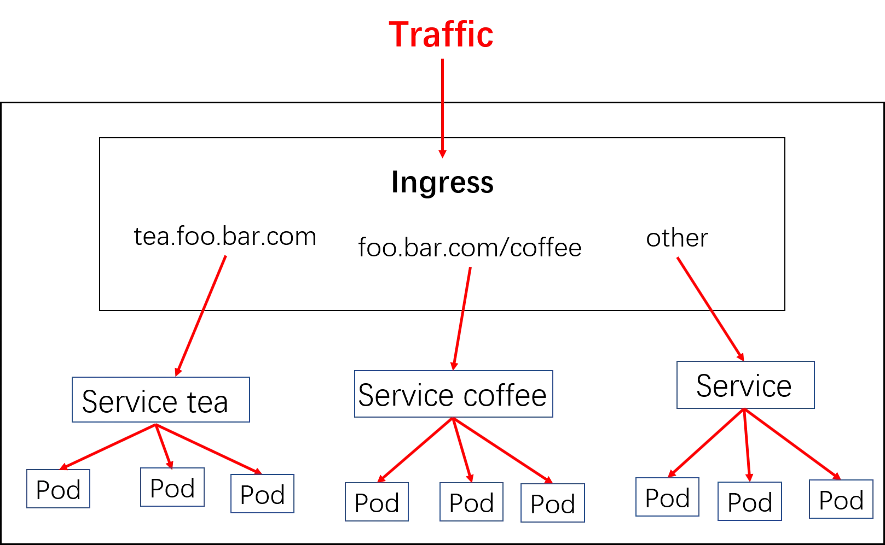

###### 实现逻辑

1）ingress controller通过和`kubernetes api交互（ingress规则存放在etcd中）`，动态的去感知集群中ingress规则变化
2）然后读取ingress规则(规则就是写明了哪个域名对应哪个service)，按照自定义的规则，`生成一段nginx配置`
3）再`写到nginx-ingress-controller的pod`里，这个Ingress controller的pod里运行着一个Nginx服务，控制器`把生成的nginx配置写入/etc/nginx/nginx.conf文件`中
4）然后`reload一下使配置生效`。以此达到域名分别配置和动态更新的问题。

###### 安装

  [官方文档](https://github.com/kubernetes/ingress-nginx/blob/master/docs/deploy/index.md)

```powershell
$ wget https://raw.githubusercontent.com/kubernetes/ingress-nginx/nginx-0.30.0/deploy/static/mandatory.yaml
## 或者使用myblog/deployment/ingress/mandatory.yaml


## 修改部署节点
$ grep -n5 nodeSelector mandatory.yaml
212-    spec:
213-      hostNetwork: true #添加为host模式
214-      # wait up to five minutes for the drain of connections
215-      terminationGracePeriodSeconds: 300
216-      serviceAccountName: nginx-ingress-serviceaccount
217:      nodeSelector:
218-        ingress: "true"		#替换此处，来决定将ingress部署在哪些机器
219-      containers:
220-        - name: nginx-ingress-controller
221-          image: quay.io/kubernetes-ingress-controller/nginx-ingress-controller:0.30.0
222-          args:

```

创建ingress

```powershell
# 为k8s-master节点添加label
$ kubectl label node k8s-master ingress=true

# 创建pod
$ kubectl apply -f mandatory.yaml
namespace/ingress-nginx created
configmap/nginx-configuration created
configmap/tcp-services created
configmap/udp-services created
...
```


查看创建的pod

```shell
[root@k8s-master week02]# kubectl -n ingress-nginx get po -owide
NAME                                        READY   STATUS    RESTARTS   AGE   IP            NODE         NOMINATED NODE   READINESS GATES
nginx-ingress-controller-7659f85d5d-n7tf9   0/1     Running   0          65s   10.240.0.11   k8s-master   <none>           <none>
```


进入pod内部查看相关进程

```shell
# 进入pod内部，其实就是启动了nginx，和nginx-congtroller
[root@k8s-master week02]# kubectl -n ingress-nginx exec -ti nginx-ingress-controller-7659f85d5d-n7tf9 bash
kubectl exec [POD] [COMMAND] is DEPRECATED and will be removed in a future version. Use kubectl exec [POD] -- [COMMAND] instead.
bash-5.0$ 
bash-5.0$ ps aux
PID   USER     TIME  COMMAND
    1 www-data  0:00 /usr/bin/dumb-init -- /nginx-ingress-controller --configmap=ingress-nginx/nginx-configuration --tcp-services-configmap=ingress-ngi
    7 www-data  0:00 /nginx-ingress-controller --configmap=ingress-nginx/nginx-configuration --tcp-services-configmap=ingress-nginx/tcp-services --udp-
   26 www-data  0:00 nginx: master process /usr/local/nginx/sbin/nginx -c /etc/nginx/nginx.conf
   38 www-data  0:00 nginx: worker process
```


使用示例：`myblog/deployment/ingress.myblog.yaml`

```yaml
apiVersion: networking.k8s.io/v1
kind: Ingress
metadata:
  name: myblog
  namespace: luffy
spec:
  rules:
  - host: myblog.luffy.com
    http:
      paths:
      - path: /
        pathType: Prefix
        backend:
          service: 
            name: myblog
            port:
              number: 80

```

应用配置生成myblog

```shell
[root@k8s-master week02]# kubectl apply -f ingress.myblog.yaml 
ingress.networking.k8s.io/myblog created

[root@k8s-master week02]# kubectl -n luffy get ingress -owide
Warning: extensions/v1beta1 Ingress is deprecated in v1.14+, unavailable in v1.22+; use networking.k8s.io/v1 Ingress
NAME     CLASS    HOSTS              ADDRESS   PORTS   AGE
myblog   <none>   myblog.luffy.com             80      59s
```

查看`host 和backends`是否关联成功

```shell
[root@k8s-master week02]# kubectl -n luffy describe ing myblog
Warning: extensions/v1beta1 Ingress is deprecated in v1.14+, unavailable in v1.22+; use networking.k8s.io/v1 Ingress
Name:             myblog
Namespace:        luffy
Address:          
Default backend:  default-http-backend:80 (<error: endpoints "default-http-backend" not found>)
Rules:
  Host              Path  Backends
  ----              ----  --------
  myblog.luffy.com  
                    /   myblog:80 (10.240.0.10:8002,10.240.1.19:8002,10.240.2.13:8002 + 1 more...)

```

windows本机hosts配置，打开浏览器访问myblog.luffy.com/admin

```
192.168.150.128 myblog.luffy.com
```


ingress-nginx动态生成upstream配置：

```yaml
$  kubectl -n ingress-nginx exec -ti nginx-ingress-controller-7659f85d5d-n7tf9 bash

# ps aux

# cat /etc/nginx/nginx.conf|grep myblog -A10 -B1
...
        ## start server myblog.luffy.com
        server {
                server_name myblog.luffy.com ;

                listen 80  ;
                listen [::]:80  ;
                listen 443  ssl http2 ;
                listen [::]:443  ssl http2 ;

                set $proxy_upstream_name "-";

                ssl_certificate_by_lua_block {
                        certificate.call()
                }

                location / {

                        set $namespace      "luffy";
                        set $ingress_name   "myblog";
                        set $service_name   "myblog";
                        set $service_port   "80";
                        set $location_path  "/";

                        rewrite_by_lua_block {
                                lua_ingress.rewrite({
                                        force_ssl_redirect = false,
                                        ssl_redirect = true,
                                        force_no_ssl_redirect = false,
                                        use_port_in_redirects = false,
                                })
--
                                balancer.log()

                                monitor.call()

                                plugins.run()
                        }

                        port_in_redirect off;

                        set $balancer_ewma_score -1;
                        set $proxy_upstream_name "luffy-myblog-80";
                        set $proxy_host          $proxy_upstream_name;
                        set $pass_access_scheme  $scheme;

                        set $pass_server_port    $server_port;

                        set $best_http_host      $http_host;
                        set $pass_port           $pass_server_port;

                        set $proxy_alternative_upstream_name "";

--
                        proxy_next_upstream_timeout             0;
                        proxy_next_upstream_tries               3;

                        proxy_pass http://upstream_balancer;

                        proxy_redirect                          off;

                }

        }
        ## end server myblog.luffy.com
 ...


```


###### 访问

域名解析服务，将 `myblog.luffy.com`解析到ingress的地址上。ingress是支持多副本的，高可用的情况下，生产的配置是使用lb服务（内网F5设备，公网elb、slb、clb，解析到各ingress的机器，如何域名指向lb地址）

本机，添加如下hosts记录来演示效果。

```json
172.21.51.143 myblog.luffy.com
```

然后，访问 http://myblog.luffy.com/blog/index/


HTTPS访问：

```powershell
#自签名证书
$ mkdir cert/
$ openssl req -x509 -nodes -days 2920 -newkey rsa:2048 -keyout tls.key -out tls.crt -subj "/CN=*.luffy.com/O=ingress-nginx"

# 证书信息保存到secret对象中，ingress-nginx会读取secret对象解析出证书加载到nginx配置中
$ kubectl -n luffy create secret tls tls-myblog --key tls.key --cert tls.crt

# 查看证书
[root@k8s-master cert]# kubectl -n luffy get secret
NAME                  TYPE                                  DATA   AGE
tls-myblog            kubernetes.io/tls                     2      12s

[root@k8s-master cert]# kubectl -n luffy get secret tls-myblog -oyaml
apiVersion: v1
data:
  tls.crt: LS0tLS1CRUdJTiBDRVJ

# base64加密
$ echo dfdas |base64 -d

```

修改yaml。添加tls配置

```yaml
apiVersion: networking.k8s.io/v1
kind: Ingress
metadata:
  name: myblog
  namespace: luffy
spec:
  rules:
  - host: myblog.luffy.com
    http:
      paths:
      - path: /
        pathType: Prefix
        backend:
          service: 
            name: myblog
            port:
              number: 80
  tls:   
  - hosts:
    - myblog.luffy.com
    secretName: tls-myblog
```

然后，访问 https://myblog.luffy.com/blog/index/


###### 多路径转发及重写的实现

###### 1. 多path转发示例

目标：

```none
myblog.luffy.com -> 172.21.51.143 -> /foo/aaa   service1:4200/foo/aaa
                                      /bar   service2:8080
                                      /		 myblog:80/

```

​	 实现：

```yaml
apiVersion: networking.k8s.io/v1
kind: Ingress
metadata:
  name: simple-fanout-example
  namespace: luffy
spec:
  rules:
  - host: myblog.luffy.com
    http:
      paths:
      - path: /foo
        pathType: Prefix
        backend:
          service: 
            name: service1
            port:
              number: 4200
      - path: /bar
        pathType: Prefix
        backend:
          service: 
            name: service2
            port:
              number: 8080
      - path: /
        pathType: Prefix
        backend:
          service: 
            name: myblog
            port:
              number: 80

```


###### 2. nginx的URL重写 ！！(工作中经常用)

目标：

```
nginx.luffy.com -> 172.21.51.143 -> /api/v1   -> nginx-v1 service
                                    /api/v2   -> nginx-v2 service
curl nginx-v1/api/v1 是不通的
curl nginx.luffy.com/api/v1 
```

实现：

```powershell
$ cat nginx-v1-dpl.yaml
apiVersion: apps/v1
kind: Deployment
metadata:
  name: nginx-v1
  namespace: luffy
spec:
  replicas: 1
  selector:
    matchLabels:
      app: nginx-v1
  template:
    metadata:
      labels:
        app: nginx-v1
    spec:
      containers:
      - image: nginx:alpine
        name: nginx-v1
        command: ["/bin/sh", "-c", "echo 'this is nginx-v1'>/usr/share/nginx/html/index.html;nginx -g 'daemon off;'"]

$ cat nginx-v1-svc.yaml
apiVersion: v1
kind: Service
metadata:
  name: nginx-v1
  namespace: luffy
spec:
  ports:
  - port: 80
    protocol: TCP
    targetPort: 80
  selector:
    app: nginx-v1
  type: ClusterIP


# 生成              
$ kubectl apply -f .


# 创建nginx-v2
[root@k8s-master rewrite]# sed -i 's/nginx-v1/nginx-v2/g' *
[root@k8s-master rewrite]# ll
total 8
-rw-r--r-- 1 root root 411 Jul 17 06:36 nginx-v1-dpl.yaml
-rw-r--r-- 1 root root 188 Jul 17 06:36 nginx-v1-svc.yaml
[root@k8s-master rewrite]# cat nginx-v1-dpl.yaml 


# 生成              
$ kubectl apply -f .

# 查看pod和service
[root@k8s-master rewrite]# kubectl -n luffy get po -owide
NAME                        READY   STATUS    RESTARTS   AGE     IP            NODE         NOMINATED NODE   READINESS GATES

nginx-v1-56df8b47c4-4v5g4   1/1     Running   0          3m7s    10.240.1.21   k8s-slave1   <none>           <none>
nginx-v2-6f967c65cf-r9869   1/1    Running   0          9s      10.240.1.22   k8s-slave1   <none>           <none>

[root@k8s-master rewrite]# kubectl -n luffy get service
NAME        TYPE        CLUSTER-IP      EXTERNAL-IP   PORT(S)        AGE
nginx-v1    ClusterIP   10.103.232.75   <none>        80/TCP         3m12s
nginx-v2    ClusterIP   10.103.179.58   <none>        80/TCP         14s


# 访问v1v2
[root@k8s-master rewrite]# curl 10.103.232.75
this is nginx-v1

[root@k8s-master rewrite]# curl 10.103.179.58
this is nginx-v2

-------------------

# 配置ingress~~
$ cat ingress-rewrite.yaml
apiVersion: networking.k8s.io/v1
kind: Ingress
metadata:
  name: nginx-rewrite
  namespace: luffy
  annotations:
    nginx.ingress.kubernetes.io/rewrite-target: /$1
spec:
  rules:
  - host: nginx.luffy.com
    http:
      paths:
      - path: /api/v1/(.*)
        pathType: Prefix
        backend:
          service:
            name: nginx-v1
            port:
              number: 80
      - path: /api/v2/(.*)
        pathType: Prefix
        backend:
          service:
            name: nginx-v2
            port:
              number: 80

# 生成ingress
[root@k8s-master rewrite]# kubectl -n luffy get ing
Warning: extensions/v1beta1 Ingress is deprecated in v1.14+, unavailable in v1.22+; use networking.k8s.io/v1 Ingress
NAME            CLASS    HOSTS              ADDRESS   PORTS     AGE
myblog          <none>   myblog.luffy.com             80, 443   51m
nginx-rewrite   <none>   nginx.luffy.com              80        43s

# 查看ingress配置
[root@k8s-master rewrite]# kubectl -n luffy describe ing nginx-rewrite 
Warning: extensions/v1beta1 Ingress is deprecated in v1.14+, unavailable in v1.22+; use networking.k8s.io/v1 Ingress
Name:             nginx-rewrite
Namespace:        luffy
Address:          
Default backend:  default-http-backend:80 (<error: endpoints "default-http-backend" not found>)
Rules:
  Host             Path  Backends
  ----             ----  --------
  nginx.luffy.com  
                   /api/v1/(.*)   nginx-v1:80 (10.240.1.21:80)
                   /api/v2/(.*)   nginx-v2:80 (10.240.1.22:80)

# 本地hosts配置
C:\Windows\System32\drivers\etc\hosts
192.168.150.128 myblog.luffy.com nginx.luffy.com


# 访问测试
$ http://nginx.luffy.com/api/v1/
$ http://nginx.luffy.com/api/v2/
```


#### 小结

1. 核心讲如何通过k8s管理业务应用
2. 介绍k8s的架构、核心组件和工作流程，使用kubeadm快速安装k8s集群
3. 定义Pod.yaml，将myblog和mysql打包在同一个Pod中，myblog使用localhost访问mysql
4. mysql数据持久化，为myblog业务应用添加了健康检查和资源限制
5. 将myblog与mysql拆分，使用独立的Pod管理
6. yaml文件中的环境变量存在账号密码明文等敏感信息，使用configMap和Secret来统一配置，优化部署
7. 只用Pod去直接管理业务应用，对于多副本的需求，很难实现，因此使用Deployment Workload
8. 有了多副本，多个Pod如何去实现LB入口，因此引入了Service的资源类型，有CLusterIp和NodePort
9. ClusterIP是四层的IP地址，不固定，不具备跨环境迁移，因此利用coredns实现集群内服务发现，组件之间直接通过Service名称通信，实现配置的去IP化
10. 对Django应用做改造，django直接使用mysql:3306实现数据库访问
11. 为了实现在集群外部对集群内服务的访问，因此创建NodePort类型的Service
12. 介绍了Service的实现原理，通过kube-proxy利用iptables或者ipvs维护服务访问规则，实现虚拟IP转发到具体Pod的需求
13. 为了实现集群外使用域名访问myblog，因此引入Ingress资源，通过定义访问规则，实现七层代理
14. 考虑真实的场景，对Ingress的使用做了拓展，介绍多path转发及nginx URL重写的实现

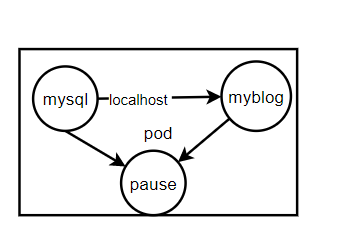

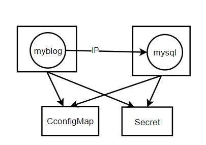

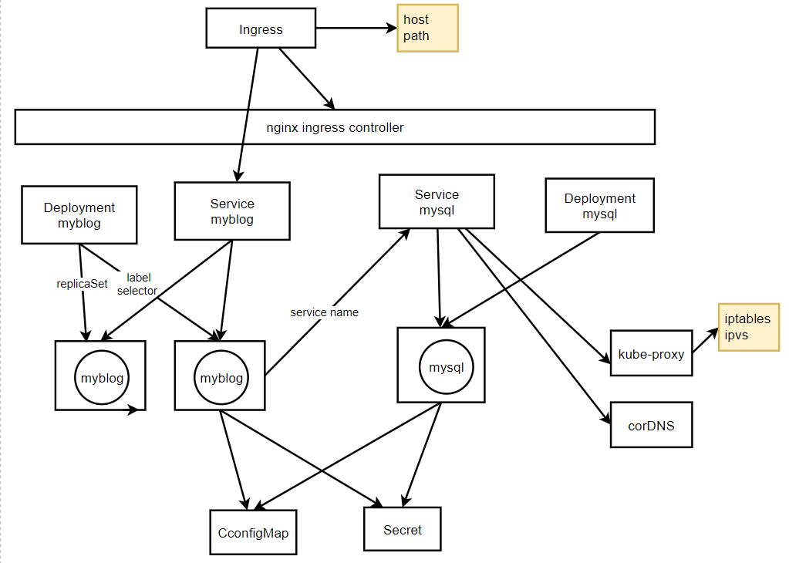

